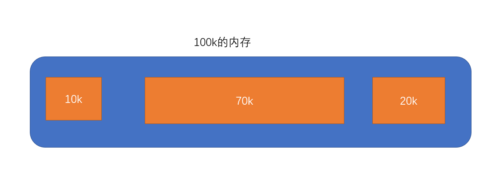
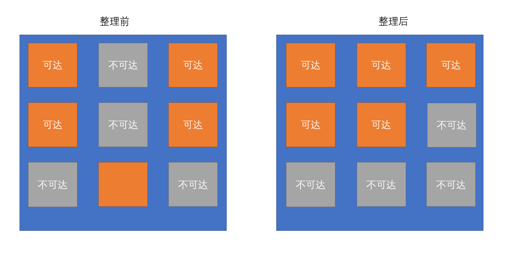
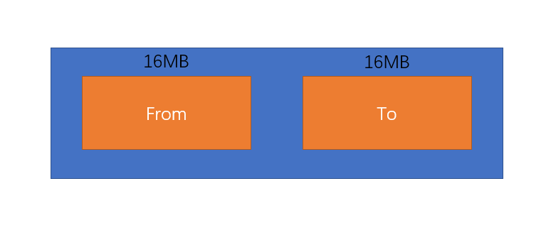
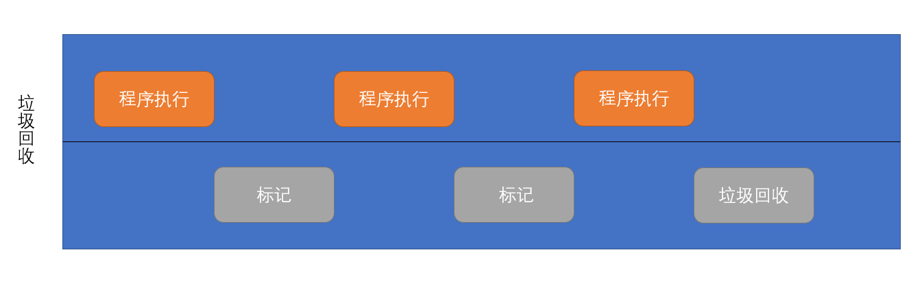

## 内存生命周期

举个例子，你现在买了新房，你需要装修，装修的时候会买一堆原料，装修过程中会产生很多垃圾，这些东西你肯定不能堆在家里，需要将他们运出去当丢掉。

同样类比到编程，程序运行的时候，你需要用到变量啊函数啊等等，这些好比原料，他们会占用内存空间，程序运行过程中有些变量，函数等用完了就没用了，但是此时他们还占用着内存空间，就好比装修垃圾还堆在你家里，程序就需要识别这些垃圾，并将它们清理掉。

不管什么编程语言，内存的生命周期都基本一致：

- 1、分配你所需要的内存。
- 2、使用分配的内存（读，写）。
- 3、不需要的时候，将其释放/归还（垃圾回收）。

看下面一段代码：

```js
function fn() {
  // 1、给arr分配一块内存，用于存储[1, 2, 3, 4, 5]
  const arr = [1, 2, 3, 4, 5]
  // 2、用内存
  return arr
}
fn()
```

思考上面代码，当我们执行完`fn`函数后，里面定义的`arr`数组是不就没用了，此时就应该将它占用的内存空间释放出来。那怎么知道这块内存没用了，以及什么时候释放这块内存呢？其实这些 JS 引擎都帮我们悄悄做了，但是它内部是如何做到的，以及原理等，是我们接下来要讨论的。

## 垃圾回收

垃圾回收英文名叫 Garbage collection，简称 GC，其中的难点就在于如何识别垃圾。

常见的 GC 算法有一下几种：

- 1、引用计数：设置引用数，当引用数为 0 的时候，就认为是垃圾。
- 2、标记清除：从根部开始循环所有对象，先标记，后清除。
- 3、标记整理：比标记清除算法多了一步整理，在标记后，先进行整理，在清除。
- 4、分代回收：分为新生代和老生代，新生代为活跃对象，多进行回收。

### 引用计数

引用计数算法是最初级的垃圾收集算法（IE6,7中用的就是这种算法），也比较好理解，看下面一段代码：

```js
// 定义一个对象{ name: '晓枫', age: 25 }，现在userInfo这个变量引用了它，引用计数为1
const userInfo = {
  name: '晓枫',
  age: 25,
}

const user1 = userInfo // 引用计数2
const user2 = userInfo // 引用计数3

// 现在对象{ name: '晓枫', age: 25 }的引用计数为3，按照引用计数的原理。
// 如果你想让垃圾回收清除它，就需要按照如下操作进行
userInfo = {} // userInfo指向另外一个对象了，所以引用计数为 3 - 1 = 2

user1 = {} // 现在user1对它的引用也没了，引用计数2 - 1 = 1
user2 = {} // 1 - 1 = 0

// 现在{ name: '晓枫', age: 25 }这个对象的引用计数就为0了，垃圾回收就开始工作，把它清理掉了
```

引用计数算法有以下优缺点：

- 优点：发现有引用计数为 0 的数据立即回收。
- 缺点：1、无法回收循环引用的对象。 2、时间开销大，需要一直监控有没有引用计数为 0 的数据。

下面来看循环引用：

```js
function fn() {
  const obj1 = {}
  const obj2 = {}
  obj1.name = obj2
  obj2.name = obj1
  return 'aaa'
}
fn()
```

思考上面代码，当函数执行完成后，obj1 和 obj2 已经没用了，应该清除掉他们，但是 obj1 内部有个 name 引用了 obj2，导致 obj2 的引用次数始终都大于等于 1，obj2 同理。所以在函数执行完成后，他俩并没有被清除掉，如果你想避免这种情况，就需要手动清除。

```js
function fn() {
  const obj1 = {}
  const obj2 = {}
  obj1.name = obj2
  obj2.name = obj1

  obj1.name = null
  obj2.name = null
  obj1 = null
  obj2 = null
  return 'aaa'
}
fn()
```

总结：引用计数优缺点如下：

- 1、优点：可以即时回收垃圾对象
- 2、缺点：无法回收循环引用的对象
- 3、缺点：消耗大，因为要一直维护那个引用计数器

### 标记-清除

这个算法的核心思想就是`对象是否可以获得`。思考上面的循环引用例子，当 fn 执行完成后，obj1 和 obj2 已经无法获得了，此时就会标记为不活动对象，GC开始工作时就会清理掉。

这个算法过程如下：

- 1、标记：从根对象开始遍历所有对象，能从根对象<span style="color: red">可达</span>的对象标记为活动对象。
- 2、清除：从根对象开始遍历所有对象，没有标记为活动对象的一律清除。

```js
const a = { num: 10 }

function fn1() {
  const b = { num: 20 }
  return b
}
const c = fn1()

function fn2() {
  const d = { num: 30 }
  return 'ccc'
}
const e = fn2()

// 思考哪些对象可达，哪些不可达

// 答案：{ num: 10 }{ num: 20 }全局可达， { num: 30 }在函数执行完成后就不可达了，垃圾回收的时候就会清理掉
```

但是标记清除算法也有一个小问题，看下图：<br/>


假设程序执行到某一阶段。垃圾回收的时候`10k`和`20k`这俩空间都被释放了，这两块空间就空闲下来了。过一会来了个需要`30k`空间的数据，此时这俩空间都存不下，那程序只能从新找一块空间大于`30k`的位置存储。造成了内存碎片化的问题。

总结：标记清除优缺点：

- 1、优点：可以回收循环引用的对象
- 2、缺点：容易产生碎片化空间，造成浪费
- 3、确定：无法立即清除无用对象，垃圾攒到一定程度在开始回收

### 标记整理

标记整理算法是标记清除的改良版，原理就是在清除前多增加一步整理的步骤，整理完成之后在进行清除，清除后的内存就是连续的了，图示如下：<br />


## V8 垃圾回收
[V8](https://zh.wikipedia.org/wiki/V8_(JavaScript%E5%BC%95%E6%93%8E))是一款JS引擎，主要用于Chrome浏览器以及一众基于Chromium内核的浏览器。

V8对内存大小做了限制，64位操作系统最大为1.4GB，32为系统最大为0.7GB。这么做的原因主要有以下两点：
- 1、V8主要是服务于浏览器的，浏览器不太可能遇到需要大内存的场景。
- 2、64位系统之所以设计成1.4GB的上限是有考量的，因为如果内存超过1.4GB的时候，V8做一次最小的垃圾回收需要50ms以上，做非增量垃圾回收需要1秒以上，在回收过程中会阻塞JS执行，这个时候你会觉得浏览器卡死了。所以设置1.4GB最大内存是一个平衡的选择。

因为垃圾回收会阻塞JS代码，所以怎么高效的进行垃圾回收就显得非常重要了。V8中的垃圾回收策略是一个综合的策略，不同的情况采用不同的策略。

V8垃圾回收总体是分为新生代和老生带两种：
- 新生代：一些存活时间短，容易发生变化的对象，比如函数内部定义的变量，如果不考虑闭包的情况，函数执行完，这些对象就应该被当做垃圾回收。内存限制64位系统32MB
- 老生带：一些存活时间长，常驻内存的对象，比如一些全局变量啊等等。内存限制64位1.4GB。

### V8如何回收新生代
新生代因为存放的是一些存活时间短的对象，所以为了效率考虑，其回收频率也会比较高。其回收策略采用的是`标记 + 复制`。



如上图所示，新生代内存等分为两个区域，From为活动区域，To为复制区域。当要触发垃圾回收的时候，From就会先进行标记，标记完成后，将可达对象（活动对象）复制到To区域，然后把From区域整理进行清除，清除完成后From和To区域交换一下。

打个比喻：你买了个新电脑（To），你需要吧旧电脑（From）有用的文件复制过来，然后你就开始找旧电脑上有用的文件，找到了就复制移动到新电脑上，当都处理完后，旧电脑就可以格式化了，然后新电脑就成了你的日常办公用品。

### 晋升
我们前面说过新生代内存上限是32MB，这点内存很容易就能达到，所以如果一些对象经常存在新生代里的话，很容易新生代内存就占满了，所以V8存在一种晋升机制，但满足下面条件的时候，新生代对象就会移动到老生代区域，简称晋升。
- 1、这个过程发生在From区域将活动对象拷贝至To区域过程中。
- 2、一轮垃圾回收（GC）后还存活的新生带对象需要晋升。也就是说上一轮垃圾回收后，这一轮垃圾回收发现你还是活动对象，就需要把你晋升到老生代区域。
- 3、To空间的使用率超过25%，如果超过25%，后续对象直接晋升。这也是个衡量结果，超过25%，后续新进来的对象就会有些不够用了。

### V8如何回收老生代
老生代存一些持续时间久的对象，比如全局变量，闭包等。它可分配内存大，而且回收频率不像老生代那么频繁。所以它的垃圾回收机制也和不太一样。

老生代主要是用标记清除策略进行垃圾回收，但是前面说过，标记清除会产生碎片化内存，当新生代对象要晋升到老生代，而老生代没有空间可存的时候，老生代就会进行一次标记整理进行空间优化，优化后在进行晋升操作。

### 增量标记
老生代还有一种优化方式叫做增量标记，前面说过垃圾回收（分标记和回收两个阶段）会阻塞JS执行，如果你都攒到一起回收的话，时间会较长，所以V8就采用了增量标记策略，说人话就是，程序执行和垃圾回收穿插着来，这样用户的感知就不明显了。图示如下：



### 新老区域对比
`新生代`因为内存小，最大32MB（无法忍受碎片空间）并且需要频繁触发，所以分了两份空间，清理的时候直接将活动对象copy到另一份空间中，然后把这个空间整体释放，这样好处就是快，采用了`空间换时间`的概念。

`老生代`内存大，最大1.4GB，触发相对新生代没那么频繁，内存相对充裕，所以不用每次都整理，就采用相对快的标记清除算法，当内存不足了，在去整体整理一下就行。采用`时间换空间`的概念，你想想如何老生代也分一半出来的话，那么700MB内存每次都空着，这样利用率就太低了。

## V8垃圾回收总结
:::tip
1、V8是目前一款主流的JavaScript执行引擎，你所熟知的Chrome、Edge、Electron等都是用的V8引擎。<br/>
2、V8是设置内存上限的，64位上限1.4GB、32位设置700MB。<br/>
3、V8内存分为新生代和老生代。并且采用分代回收的策略进行垃圾回收。<br/>
4、新生代采用`标记整理 + 复制`策略，老生代采用`标记清除（主） + 标记整理（辅）+ 增量标记`策略。<br/>
:::

