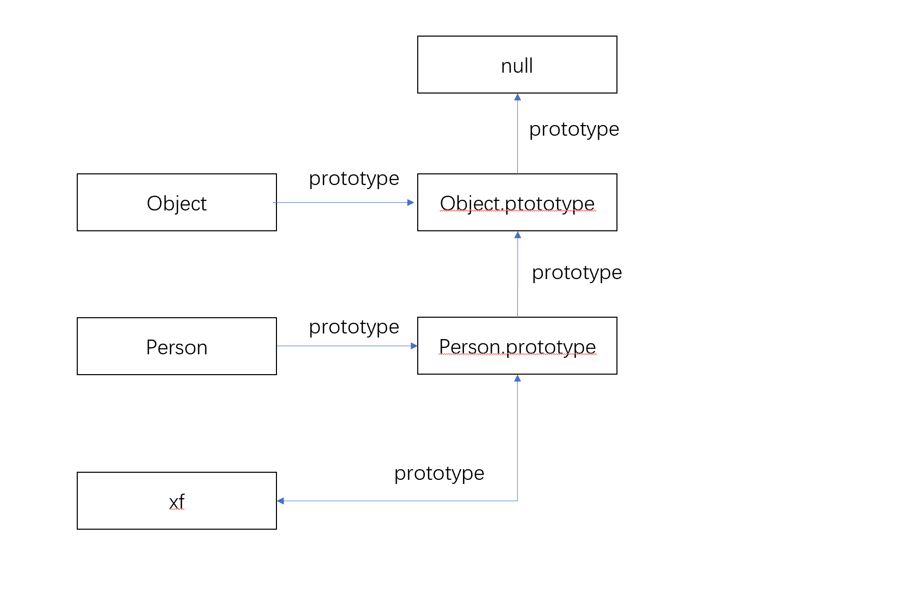

最近面试盲目的看源码啊乱七八糟的，结果面试反而栽在一些基础知识上了，所以决定务实JS功底，正好赶上拉钩出了[JavaScript核心原理课程](https://kaiwu.lagou.com/course/courseInfo.htm?courseId=601&sid=20-h5Url-0#/content)，就顺便边学边总结。

## JS数据类型
这应该是最最最基本的了，JS分为基础数据类型和引用数据类型两大类。

- 基础数据类型：Boolean、String、Number、undefined、null、Symbol（面快手的时候我居然只想起来前三个，真丢人）
- 引用数据类型：Array、Function、Object、RegExp、Date、Math。

## 类型判断
数据类型检测这在日常开发中应该是经常遇到的，下面以一道面试题切入。  

面试题：如何判断一个js变量是数组类型，你有哪些判断方法。

思考：首先排除`typeof`，因为这个只能判断基础数据类型，数组属于引用类型，`typeof`无法判断。

### 方法一：instanceof
:::tip
`instanceof`运算符用于检测构造函数的 prototype 属性是否出现在某个实例对象的原型链。
:::
上面这句话我初看是没太理解啥意思，一番学习理解后，大概意思如下：
```js
function Person(name, age) {
  this.name = name;
  this.age = age;
}

let xf = new Person('晓枫', 25)
console.log(xf instanceof Person)   // true

// 简单理解就是判断xf的原型链式是否有Person的原型，换成代码展示如下
// 第一步：获取xf的原型
let xfProto = Object.getPrototypeOf(xf)
// 第二步：获取Person的原型
let PersonProto = Person.prototype

// 第三步，判断两者是否相等
console.log(xfProto === PersonProto)  // true

// 如果第三步判断不相等的话，就顺着xf的原型链继续找，直到找到相等的，或者找完原型链为止。
```

当我说到`instanceof`可以判断数组类型的时候，面试官又问我，那你能手动实现一个`instanceof`方法吗？（当时没写上来，结束后就立马查资料看了看实现原理）
```js
function myInstanceof(target, type) {
  // 如果要检测的目标为基础数据类型或者为null，则直接返回false
  if(typeof target !== 'object' || target === null) return false;

  // 获取目标原型
  let proto = Object.getPrototypeOf(target)
  // JS中任何数据原型链的终点都是null，所以这里可以通过盘点proto来判断原型链是否走到尽头
  while(proto) {
    if(proto === type.prototype) return true;
    // 走到这里说明不相等，继续顺着原型链往下找
    proto = Object.getPrototypeOf(proto)
  }
  // 走到这里，说明原型链查找完毕了，也没有找到和type.prototype相等的，返回false
  return false
}

// 测试一
function Person() {}
let xf = new Person()
console.log(myInstanceof(xf, Person))   // true

// 测试二
let arr1 = [1,2,3]
console.log(myInstanceof(arr1, Array))   // true

// 测试三
let arr2 = [1,2,3]
console.log(myInstanceof(arr2, Object))  // true
```
拿测试一来举例，图示如下：<br />


`instanceof`原理就是判断构造函数Person的prototype是否在实例xf的原型链上。
同理你也应该明白下面代码为何也是true了。
```js
function Person() {}
let xf = new Person()

console.log(xf instanceof Object)
```

### 方法二(常用)：Object.prototype.toString().call()  
上面的`instanceof`其实不常用，你在各种源码库里看到最常用判断数据类型的应该是这种方法。

JS原生的`Object原型`上挂了一个`toString`方法，调用会返回`'[object Xxx]'`，Xxx就代表当前`this指向`的类型。于是就有人想到通过`call`来改变this指向，让`this`指向你要判断的那个变量，进而让Xxx返回不同的值，来做数据类型判断。

```js
// 基础类型
let a = "hello wrold";
let b = 123;
// 引用类型
let c = [1,2,3]
let d = {}


console.log(Object.prototype.toString.call(a) === '[object String]')    // true
console.log(Object.prototype.toString.call(b) === '[object Number]')    // true
console.log(Object.prototype.toString.call(c) === '[object Array]')    // true
console.log(Object.prototype.toString.call(d) === '[object Object]')    // true
```
:::tip
这种判断类型的方法应该是最常用的，要理解其背后原理，一般你答出这种方法后，面试官还要问一下原理。<br/>
原理就是上面所说的，利用原生JS的`Object原型`上提供的`toString`方法，通过改变`this`指向这种技巧来巧妙的判断类型
:::

### 方法三（PS：这个方法是数组独有的，不适用于通用的类型判断）
JS原生`Array原型`上带有一个专门判断数组类型的函数，叫做`isArray`，使用方法如下：
```js
let arr = [1,2,3]
console.log(Array.isArray(arr))   // true
```

## 类型判断总结
:::tip
1、判断数组类型首选`Array.isArray`。<br/>
2、判断基础类型首选`typeof`。<br/>
3、通用类型判断，首选Object.prototype.toString.call()
:::
实现一个通用类型判断函数：
```js
function getType(target) {
  if (typeof target !== "object") {
    return typeof target;
  }
  return Object.prototype.toString
    .call(target)
    .replace(/^\[object (\S+)]$/, "$1");
}
let arr = [1, 2, 3];
console.log(getType(arr) === "Array"); // true
```

