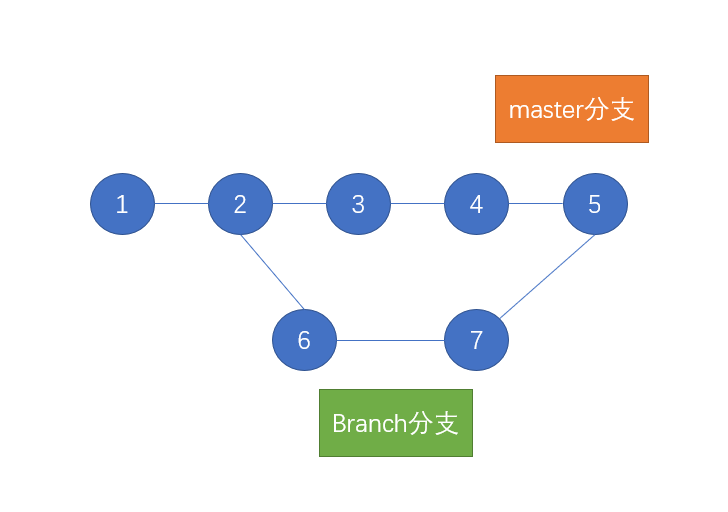
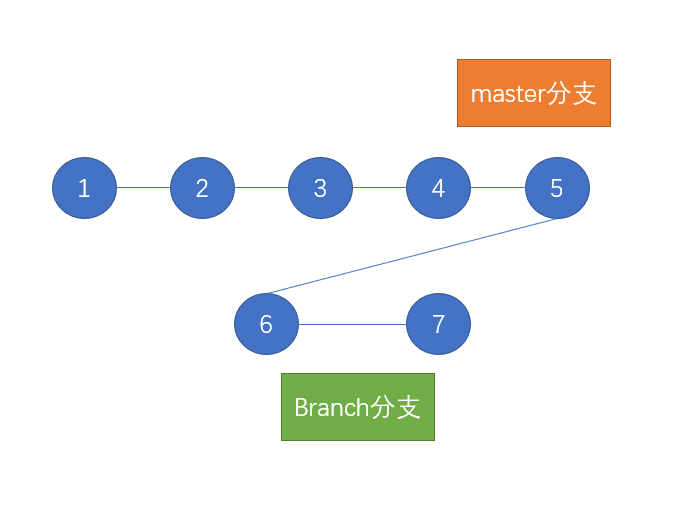
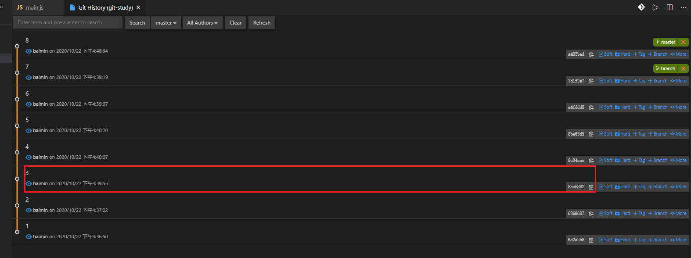
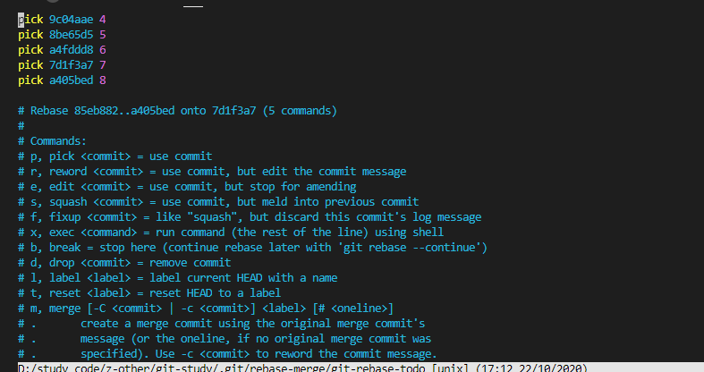
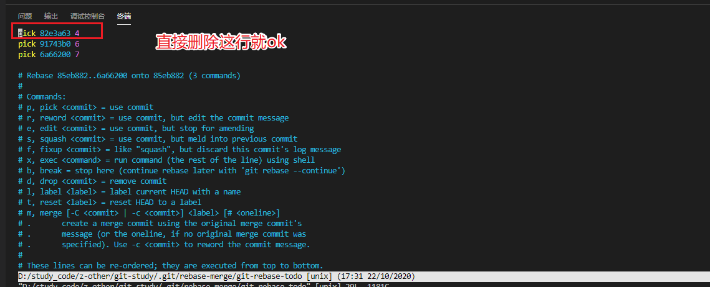

主要记录自己目前不太懂的一些点

## git pull 和 git fetch区别
我记得我有次面试，面试官问我这问题，我但是只知道git fetch是同步远程代码，后来查资料才知道
```sh
# 拉取远程最新代码
git fetch
# 合并两个分支代码
git merge 

# 拉取远程最新代码并与本地分支进行合并
git pull 

# 结论
git pull = git fetch + git merge
# or
git pull = git fetch + git rebase
```

## 取消merge
如果你从别的分支merge过来代码发现有冲突，想退回到merge之前。
```sh
# 回到merge之前
git merge --abort
```

## push
这里直说一个点，本地新建的分支如何推送到远端
```sh
# push时，如果本地新创建的分支，推送的时候需要指定远程仓库名(origin)和分支名(xxx)
git push origin xxx
```

## Feature Branching: 最流行的工作流
小公司或者小团队有时候经常是直接在master上开发，这种方式存在弊端，容易造成master分支混乱，并且加大了出错的可能。当人多了以后这种方式问题就会越来越严重。

所以目前会出现了这种Feature Branching的工作流，总结如下：
- 1、任何新的功能或者bug修复都要新建一个branch分支来写。
- 2、当branch开发完成后，合并到master分支，并删除这个branch。

这种开发的好处如下：
- 1、避免了直接改master，减少了出错的可能。
- 2、方便review。你开发完成后，将新分支告诉同事，同事review通过后，并入master分支。
- 3、方便一人多任务开发，比如你正在开发A功能，突然产品过来让你紧急改个bug，此时你给当前分支一个commit，标记为未完成，然后在新开一个分支去解决bug。

## git log
```sh
# 查看详细历史。
git log -p   # git log --patch 的简写

# 查看简要统计
git log --stat 

# 查看具体的commit
git show  xxxx  # xxxx就是那个对应的HEAD标记
```

## git rebase 
git merge 会在Git的历史中留下分叉，这种分叉后又会和的方式有些人会觉得换乱，所以还有个命令能提到merge，叫做rebase

rebase（变基）：在新位置重新提交

看下面图示：
 <br/>
如果此时在branch执行以下命令：
```sh
git rebase master
```

这个图就会变成这样：<br/>


可以看出经过rebase后，branch分支开始的基点就变成master分支最后一次commit的点了，此时在执行merge，在Git历史上就不会有分叉了。
```sh
git checkout master
git merge branch
```

总结：如果你不想Git历史有分叉，那你在别回master分支之前执行一个`git rebase master`，然后在切分支`merge`。
```sh
# 有分叉的
git checkout master
git merge branch 


# 无分叉的
git rebase master
git checkout master
git merge branch
```

## 修改commit

### 修改最近commit
开发中经常会有一个问题，刚改完一个bug，提交`commit`后，发现有些地方写错了，此时我一般就会改完在重新提交一个`commit`。

除此之外，还有一个更加优雅的方法: commit --amend。<br/>

`amend`意思是修正的意思，如果在`commit`结尾加上`--amend`参数，git不会新增`commit`，而是会把当前`commit`和最近一次`commit`合并起来，并创建一个新的commit。

### 修改之前的commit
上面的`amend`只能修改最近一次commit，而你如果想修改之前的`commit`的话，就又需要用到`rebase`了，不过这次需要加个参数`-i`。

`git rebase -i HEAD^`是`git rebase --interactive HEAD^`的缩写。

假如我要对下图中的commit 4进行修改 <br/>


```sh
# 注意这里结尾的hash值应该是commit 4下面的3，反正就是你要处理的commit下面的那个commit
git rebase -i 85eb882
```
git展示如下图：


你如果要编辑，就把`pick`改成`e(edit)`，如果要合并，就改成`s(squash)`，假如这里要编辑，改成`e(edit)`后退出，此时当前代码就回到了commit 4时候的代码了。

然后就按照上面的修改最近commit的方式修改就好了。修改完以后执行`git rebase --continue`。

至此这次修改旧commit就算完成了。查看第四个commit，内容也改成我们最新的了。


## git reset
比如最近提交的代码有问题，我想回退到之前的版本
```sh
git reset --hard HEAD^
```

## 删除commit
如果要删除历史某个commit，还是以commit 4为例，操作如下:
```sh
git rebase -i 85eb882
```

保存退出后，在看git历史就没有`4`这次提交了。
