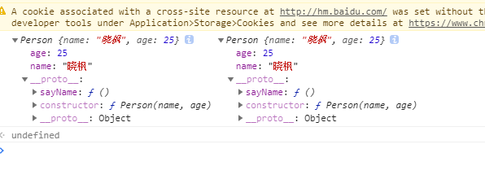

面试中经常会问一下js中new操作符原理是啥，简单看了看别人说的，大部分情况都是一知半解，所以准备自己好好研究一波

## new一个实例
下面的代码肯定不陌生：
```js
function Person(name, age) {
  this.name = name;
  this.age = age;
}
Person.prototype.sayName = function () {
  console.log(this.name);
};
let p = new Person('晓枫', 25)
console.log(p)  // Person { name: '晓枫', age: 25 }
```

## new Person()做了什么
先来看mdn中的描述：
:::tip
当代码 new Foo(...) 执行时，会发生以下事情：

- 一个继承自 Foo.prototype 的新对象被创建。
- 使用指定的参数调用构造函数 Foo，并将 this 绑定到新创建的对象。new Foo 等同于 new Foo()，也就是没有指定参数列表，Foo 不带任何参数调用的情况。
- 由构造函数返回的对象就是 new 表达式的结果。如果构造函数没有显式返回一个对象，则使用步骤1创建的对象。（一般情况下，构造函数不返回值，但是用户可以选择主动返回对象，来覆盖正常的对象创建步骤）
:::
那我们就按照这个说明一步步来，实现代码如下：
```js
function createObj(target, ...args) {
  // 一个继承自 Foo.prototype 的新对象被创建。
  var newObj = Object.create(target.prototype);
  // 使用指定的参数调用构造函数 Foo，并将 this 绑定到新创建的对象。new Foo 等同于 new Foo()，也就是没有指定参数列表，Foo 不带任何参数调用的情况。
  var result = target.apply(newObj, args);
  // 由构造函数返回的对象就是 new 表达式的结果。如果构造函数没有显式返回一个对象，则使用步骤1创建的对象。（一般情况下，构造函数不返回值，但是用户可以选择主动返回对象，来覆盖正常的对象创建步骤）
  return typeof result === 'object' ? result : newObj;
}
```
测试如下：
```js
function Person(name, age) {
  this.name = name;
  this.age = age;
}
Person.prototype.sayName = function () {
  console.log(this.name);
};
function createObj(target, ...args) {
  var newObj = Object.create(target.prototype);
  var result = target.apply(newObj, args);
  return typeof result === 'object' ? result : newObj;
}
let p1 = new Person('晓枫', 25)
let p2 = createObj(Person, '晓枫', 25);
console.log(p1, p2)
```


对比下来，一毛一样