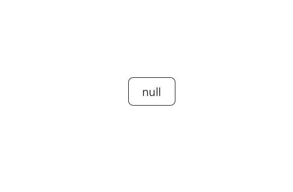
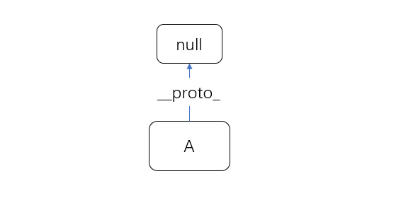
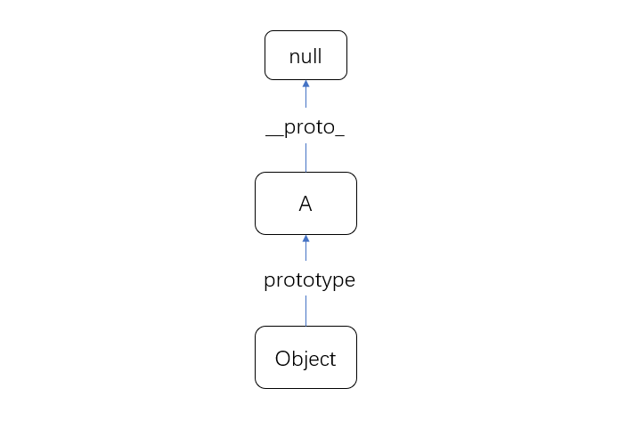
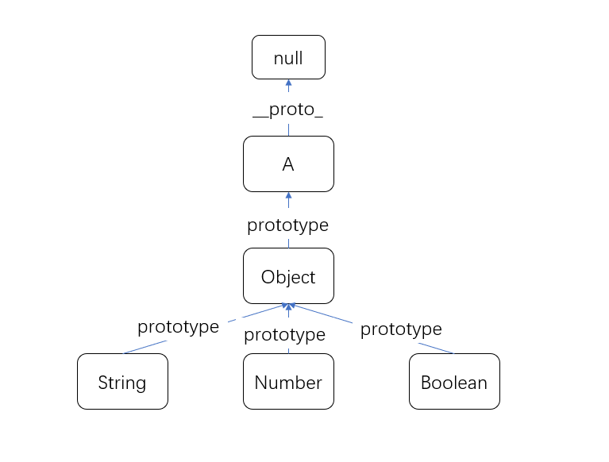
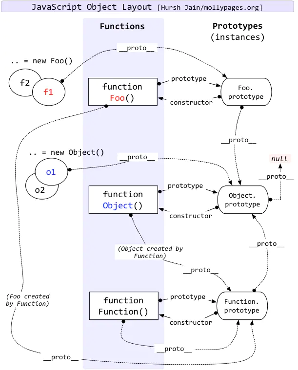

## 结论
先说结论：<br/>
**原型模式：先创建一批基础对象，以后新建对象的时候，就从这批对象中克隆返回给新对象。**

## 类和原型
我了解到，历史上有两种实现面对对象的主流方式，一种是基于类的，如`java`、`c++`这种，还有一种是基于原型的，如前端的`javascript`。
虽然现在的ES6也出现了基于类的方式，但它只是一个语法糖，背后还是ES5原型那一套。

面对对象编程中有两个非常基础，非常重要的概念，就是`类(class)`和`对象(Object)`，基于类这一套是先定义类，然后通过类去实例化对象，基于原型呢先创建一个对象A，创建B对象的时候，就以A为原型来`copy`，类似我们中文说的`照猫画虎`，猫就是原型。

在举个例子：生产汽车，第一种方法是先画图纸，然后将图纸上的零件都生产出来，然后将零件组装成汽车。
第二种方法是，先有一堆零件，然后从一堆零件中组合一个汽车出来。


示例一：
```js
// cat是猫的一个实例
var cat = {
  name: '哈喽keiti'
}

var tiger = Object.create(cat)
console.log(tiger.name)
```
看上面这个例子，tiger这个对象我们明显没有设置name属性，为啥输出是`哈喽keiti`，这就是[原型模式](https://zh.wikipedia.org/wiki/%E5%8E%9F%E5%9E%8B%E6%A8%A1%E5%BC%8F)

**题外话**：面对对象我们都知道是从现实世界中抽象出来的，其实你仔细想想，原型模式是不更加符合现实世界的模型，你出生是通过你妈这个具体的实例来生成的，继承也是继承你爹你妈的财富。你的出现和继承都是基于两个具体的实例。

## 生命起源
关于地球上的万物起源，有一种说法是一开始是啥也没有，然后各种噼里啪啦闪电啊，火山喷发啊之类的，产生了有机物，有机物呼啦呼啦的慢慢的产生了第一个生命体，叫什么芽孢之类的，然后芽孢通过复制分裂，分裂后的芽孢继续分裂，过程中还便随这变异，渐渐的产生了现在这样各种各样的生命体。

## JS起源
- 1、JS一开始只有null（也就是啥也没有）<br/>

- 2、噼里啪啦一顿操作，产生了第一个生命体（对象），暂且叫A，叫啥其实无所谓

- 3、还记得我们开头说的原型模式吗，想要这个模式跑的通就需要有基础对象，现在我们有了一个基础对象A，那它是不就能作为原型去创建别的对象了，这样超级对象Object诞生了，Object的原型就指向了A。一开始我在想，为啥A不是Object呢，直接A是Object，然后其它像什么Array啊，String啊这一类的原型都指向A不得了，还非得通过A在搞个Object超级对象出来干啥，但是你在回头看一眼原型这个模式，就会发现A没有对象可以当它的原型啊，所以只能是它作为别人的原型。so，图示如下：

- 4、生命的演化过程中不断的在进化，一个物种往往可以演化出很多个物种，我们现在有了Object这个物种，就可以通过它演化出String、Number、Boolean、Array、Date等等这些新对象，它们都有一个共同特点，就是原型指向了Object。图示如下：


看到这里，相信你已经对原型这种模式有个大致的认识了，大概知道这是个啥玩意了。下面了解一下js中的prototype和__proto__

## prototype和__proto__
看一下JavaScript中对于prototype和__proto__的描述
:::tip
- prototype: 我们创建的每一个函数都有一个prototype(原型)属性，这个属性是一个指针，指向一个对象
- __proto__: 当调用构造函数创建一个新实例后，该实例的内部将包含一个指针，指向构造函数的原型，在Firforx,Safari和Chrome中在每个对象上都支持一个熟悉__proto__。
:::
总结：
- 相同点：prototype和__proto__都是用来访问原型对象的
- 不同点：prototype是构造函数用来访问原型的，__proto__是具体实例访问原型的

在chrome中试着运行以下代码，看看是不和你想的一样：
```js
function Person() {}
Person.prototype.sayHello = function() {
  console.log('hello')
}
let p = new Person();
console.log(p.__proto__)
console.log(Person.prototype)
console.log(p.__proto__ === Person.prototype)
```

如果上面你都看懂了，在来张经典图，相信仔细点看，看懂应该没问题。


:::tip
最后附上参考文章：
[JavaScript 世界万物诞生记](https://zhuanlan.zhihu.com/p/22989691)
:::
