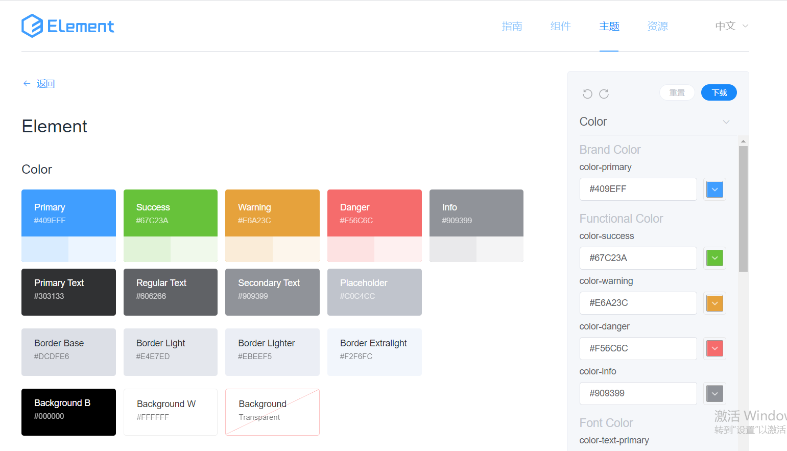
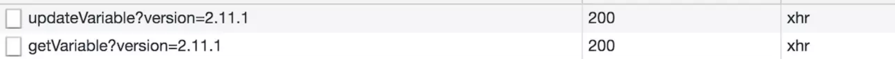
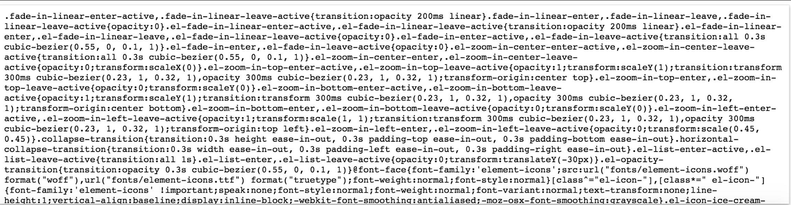
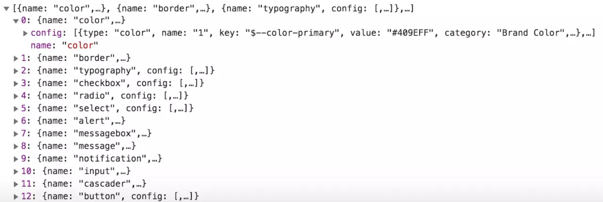

# `element-ui` 技术揭秘（2）- 组件库的整体设计
[原文地址](https://juejin.im/post/5d64fa0af265da03cd0a8e7f)

## 需求分析

当我们去实现一个组件库的时候，并不会一上来就撸码，而是把它当做产品一样，思考一下我们的组件库的需求。那么对于 `element-ui`，除了基于 Vue.js 技术栈开发组件，它还有哪些方面的需求呢。

1. 丰富的 feature：丰富的组件，自定义主题，国际化。
2. 文档 & demo：提供友好的文档和 demo，维护成本小，支持多语言。
3. 安装 & 引入：支持 npm 方式和 cdn 方式，并支持按需引入。
4. 工程化：开发，测试，构建，部署，持续集成。

需求有了，接下来就需要去思考如何去实现，本文会依据 `element-ui` 2.11.1 版本的源码来分析这些需求是如何实现的。当然，`element-ui` 早期一定不是这样子的，我们分析的这个版本已经是经过它多次迭代优化后的，如果你想去了解它的发展历程，可以去 GitHub 搜索它的历史版本。

## 丰富的 feature

### 丰富的组件
组件库最核心的还是组件，先来看一下 `element-ui` 组件的设计原则：一致、反馈、效率、可控。具体的解释在官网有，我就不多贴了，在 `element-ui` 开发团队背后，有一个强大的设计团队，这也得益于 `element-ui` 的创始人 sofish 在公司的话语权和地位，争取到这么好的资源。所以 `element-ui` 组件的外型、配色、交互都做的非常不错。
作为一个基础组件库，还有一个很重要的方面就是组件种类丰富。`element-ui` 官方目前有 55 个组件，分成了 6 大类，分别是基础组件、表单类组件、数据类组件、提示类组件、导航类组件和其它类型组件。这些丰富的基础组件能很好地满足大部分 PC 端 to B 业务开发需求。

> 开发这么多组件，需要大量的时间和精力，所以这里要非常感谢 `element-ui` 团队，为我们提供了这些基础组件，我们基于它们做二次开发，节约了非常多的时间。
>

`element-ui` 的组件源码在 `packages` 目录里维护，而并不在 `src` 目录中。这么做并不是为了要采用 monorepo，我也并没有找到 lerna 包管理工具，这么做的目的我猜测是为了让每个组件可以单独打包，支持按需引入。但实际上想达到这个目的也并不一定需要这么去组织维护代码，我更推荐把组件库中的组件代码放在 `src/components` 目录中维护，然后通过修改 webpack 配置脚本也可以做到每个组件单独打包以及支持按需引入，源码放在 `src` 目录总是更合理的。


### 自定义主题
element-ui 的一大特色是支持自定义主题，你可以使用在线主题编辑器，可以修改定制 Element 所有全局和组件的 Design Tokens，并可以方便地实时预览样式改变后的视觉。同时它还可以基于新的定制样式生成完整的样式文件包，供直接下载使用，那么它是如何做到这点的呢？



element-ui 组件的样式、公共样式都在 packages/theme-chalk 文件中，并且它是可以独立发布的。element-ui 组件样式中的颜色、字体、线条等等样式都是通过变量的方式引入的，在 packages/theme-chalk/src/common/var.scss 中我们可以看到这些变量的定义，这样就给做多主题提供了方便，因为我只要修改这些变量，就可以实现组件的主题改变。

了解了基本原理，做在线替换主题也并不是难事了，我并不会详细去讲在线定制主题前端交互部分，感兴趣的同学可以自己去看源码，都在 examples 目录中，我这里只说一下本质的原理。  

想要做到在线换肤，并且实时预览，需要借助 server 的帮助，比如主题可以通过一个配置去维护，用户做一系列操作后，会生成新的主题配置，把这个配置通过接口提交的方式告诉 server，然后 server 会根据这个配置做返回生成新的 CSS（具体的实施的方案未开源，大致会做一些变量替换，然后编译），新的 CSS 的样式就会覆盖默认的样式，达到了切换主题的目的。
我们可以在主题编辑页面打开网络面板，可以看到有 2 个 xhr 请求，如图：



其中，updateVarible 是一个 POST 请求，他会把你修改的的主题配置提交到后端 server，提交的数据你可以自己去查看它的 Request Payload，这个 POST 请求会返回一段 CSS 文本，然后会动态插入到 head 标签的底部，来覆盖默认样式，你可以通过审查元素看到 head 底部会动态插入一个 id 为 chalk-style 的标签。
下图就是该请求返回的样式文本 ：


相关代码在 examples/components/theme/loader/index.vue 中。

```js
onAction() {
  this.triggertProgressBar(true);
  const time = +new Date();
  updateVars(this.userConfig)
    .then(res => {
      this.applyStyle(res, time);
    })
    .catch(err => {
      this.onError(err);
    })
    .then(() => {
      this.triggertProgressBar(false);
    });
},
applyStyle(res, time) {
  if (time < this.lastApply) return;
  this.updateDocs(() => {
    updateDomHeadStyle('chalk-style', res);
  });
  this.lastApply = time;
}

```

onAction 函数中的 updateVars 就是去发送 POST 请求，而 applyStyle 函数就是去修改和覆盖默认样式，updateDocs 函数会去更新默认主题颜色，updateDomHeadStyle 样式会添加或者修改 id 为 chalk-style 的 style 标签，目的就是覆盖默认样式，应用新主题样式。
updateVars 请求在页面加载的时候会发起，在你修改完主题配置后也会发起。
再来看一下 getVarible 请求，它是一个 GET 请求，返回的内容是主题配置页面右侧配置面板的数据源，如下图所示：



主题配置面板根据该数据源生成，并且当你去编辑其中一项的时候，又会发起 updateVars POST 请求，把更新的配置提交，然后后端会返回新的 CSS 并在前端生效。
另外，用户修改的配置还利用了 localStorage 在本地保存了一份，这样用户每次编辑都可以保存一份主题，下次也可以继续基于某个主题继续编辑。
不过，这么实现多主题也并非完美，为了编译加速，element-ui 把样式部分单独抽离出单独的文件，这样给开发组件的同学带来很大的不便，当你去编写组件的样式的时候，需要在多个文件中来回切换，而且这样也不符合组件就近管理的原则。但是如果把样式写在组件中，server 端去编译生成单独样式文件的时间就会增长（需要从组件中提取 CSS），所以这是一个需要权衡的问题。

### 国际化
说到 Vue 的国际化方案，大家很容易会联想到 vue-i18n 方案，element-ui 并未引入 vue-i18n，不过它是可以很好地与 vue-i18n 兼容的。
所有的国际化方案都会用到语言包，语言包通常会返回一个 JSON 格式的数据，element-ui 组件库的语言包在 src/locale/lang 目录下，以英语语言包为例：
```js
export default {
  el: {
    colorpicker: {
      confirm: 'OK',
      clear: 'Clear'
    }
    // ...
  }
}
```

在 packages/color-picker/src/components/picker-dropdown.vue 中，我们在模板部分可以看到这个语言包的使用：
```html
<el-button
  size="mini"
  type="text"
  class="el-color-dropdown__link-btn"
  @click="$emit('clear')">
  {{ t('el.colorpicker.clear') }}
</el-button>
<el-button
  plain
  size="mini"
  class="el-color-dropdown__btn"
  @click="confirmValue">
  {{ t('el.colorpicker.confirm') }}
</el-button>
```
模板中用到的 t 函数，它定义在 src/mixins/locale.js 中：
```js
import { t } from 'element-ui/src/locale';

export default {
  methods: {
    t(...args) {
      return t.apply(this, args);
    }
  }
};
```
实际上是在 src/locale/index.js 中定义的 t 函数：
```js
export const t = function(path, options) {
  let value = i18nHandler.apply(this, arguments);
  if (value !== null && value !== undefined) return value;

  const array = path.split('.');
  let current = lang;

  for (let i = 0, j = array.length; i < j; i++) {
    const property = array[i];
    value = current[property];
    if (i === j - 1) return format(value, options);
    if (!value) return '';
    current = value;
  }
  return '';
};
```
这个函数是根据传入的 path 路径，比如我们例子中的 el.colorpicker.confirm，从语言包中找到对应的文案。其中 i18nHandler 是一个 i18n 的处理函数，这块逻辑就是用来兼容外部的 i18n 方案如 vue-i18n。
```js
let i18nHandler = function() {
  const vuei18n = Object.getPrototypeOf(this || Vue).$t;
  if (typeof vuei18n === 'function' && !!Vue.locale) {
    if (!merged) {
      merged = true;
      Vue.locale(
        Vue.config.lang,
        deepmerge(lang, Vue.locale(Vue.config.lang) || {}, { clone: true })
      );
    }
    return vuei18n.apply(this, arguments);
  }
};

export const i18n = function(fn) {
  i18nHandler = fn || i18nHandler;
};

export const use = function(l) {
  lang = l || lang;
};
```
可以看到 i18nHandler 默认会尝试去找 Vue 原型中的 $t 函数，这是 vue-i18@5.x 的实现，会在 Vue 的原型上挂载 $t 方法。  

另外它也暴露了 i18n 方法，可以外部传入其它的 i18n 方法，覆盖 i18nHandler。  

如果没有外部提供的 i18n 方法，那么就直接找到当前的语言包 let current = lang;，接下来的逻辑就是从这个语言包对象中读到对应的字符串值，当然如果字符串需要格式化则调用 format 函数，这块逻辑同学们感兴趣可以自己看。  

因此在使用对应的语言包的时候一定要注册：
```js
import lang from 'element-ui/lib/locale/lang/en'
import locale from 'element-ui/lib/locale'

// 设置语言
locale.use(lang)
```
这样就注册了英文语言包，在模板中就可以正常使用并找到对应的语言了。
如果你要开发一个国际化项目，在运行时才能知道用户的语言，可以考虑使用异步动态加载的方式，在渲染页面前先获取语言包，另外也可以考虑做缓存优化，不过这个话题延伸起来就有点多了，未来我可能会单开一个主题去分享业务如何做国际化。
