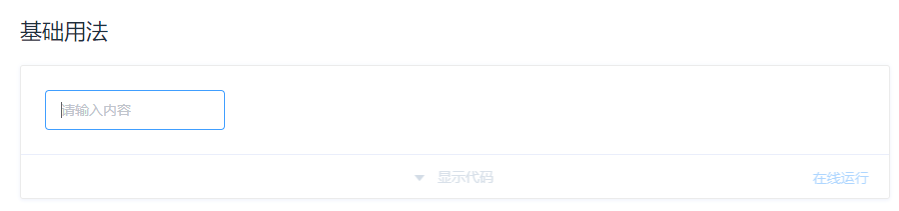

# input组件
input组件是在日常开发中用到最多的组件之一了，看着觉得应该挺简单，但是看了一下源码后，发现整个代码 加起来有500多行，下面就带着学习的目的一步步了解`el-input`源码是如何实现的。
## 需求分析
先来看一个最基础的input框：

下面我们先简单实现一下上面这个`input`框：
```vue
<template>
  <div class="el-input">
    <input 
      type="text"
      class="el-input__inner"
      v-bind="$attrs"
      @input="handleInput"
    />
  </div>
</template>
<script>
  export default {
    name: 'ElInput',
    methods: {
      handleInput(e) {
        this.$emit('input', e.target.value)
      }
    }
  }
</script>
```
### disabled状态
```vue 
props: {
  disabled: Boolean
}
```