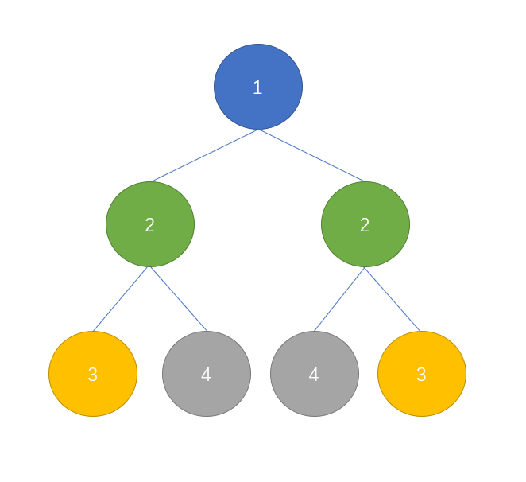

[原题地址](https://leetcode-cn.com/problems/symmetric-tree/)

给定一个二叉树，检查它是否是镜像对称的。


例如，二叉树 [1,2,2,3,4,4,3] 是对称的。
```md
    1
   / \
  2   2
 / \ / \
3  4 4  3
```

但是下面这个 [1,2,2,null,3,null,3] 则不是镜像对称的:
```md
    1
   / \
  2   2
   \   \
   3    3
```
进阶：

你可以运用递归和迭代两种方法解决这个问题吗？

## 分析
这题难度显示简单，但我感觉一点也不简单，挺难的。

看下图：<br/>


要实现对称，上图中除根节点外，有颜色的都要相等，并且左右节点要么同时存在，要么同时不存在。

## 实现代码
方法一：递归
```js

```