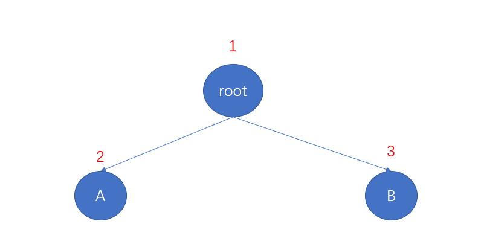

[原题地址](https://leetcode-cn.com/problems/binary-tree-preorder-traversal/)

给定一个二叉树，返回它的 前序 遍历。

示例:
```md
输入: [1,null,2,3]  
   1
    \
     2
    /
   3 

输出: [1,2,3]
```
进阶: 递归算法很简单，你可以通过迭代算法完成吗？

## 分析
先说明一下什么叫前序遍历

如果遍历是按照1 -> 2 -> 3这种就是前序遍历 <br/>
如果遍历是按照2 -> 1 -> 3这种就是中序遍历 <br/>
如果遍历是按照2 -> 3 -> 1这种就是后序遍历 <br/>

规律就是root根节点在哪个位置就是那种遍历方式。

说明：这题输入显示的是[1, null, 2, 3]，根据它给定的结构，转换成js数据 结构如下：
```js
const root = {
  val: 1,
  right: {
    val: 2,
    left: {
      val: 3
    }
  }
}
```
换成这样的话，不看下面的代码，试着思考一下如何用递归处理上面数据，并返回[1,2,3];

递归实现代码：
```js
/**
 * Definition for a binary tree node.
 * function TreeNode(val) {
 *     this.val = val;
 *     this.left = this.right = null;
 * }
 */
/**
 * @param {TreeNode} root
 * @return {number[]}
 */
var preorderTraversal = function(root) {
  // 定义结果数组
  const result = [];
  // 递归函数
  function dfs(node) {
    if(!node) {
      return
    }

    // 先序遍历，需要先将root节点推到第一个位置
    result.push(node.val)

    dfs(node.left)
    dfs(node.right)
  }
  // 初始化调用递归函数
  dfs(root)
  return result
};
// 执行用时：92 ms, 在所有 JavaScript 提交中击败了6.11%的用户
// 内存消耗：37.7 MB, 在所有 JavaScript 提交中击败了5.55%的用户
```

## 进阶
题目描述中，最后有一行字，递归算法很简单，你可以通过迭代算法完成吗?

我们知道，递归就是使用了栈这种结构，遇到一个函数，压入调用栈中，依次循环出栈，直到栈为空。思路如下：
- 首先根节点入栈
- 根节点出栈，并将val推入结果数组
- 判断根节点左右节点是否为空，不为空则推入栈中
- 循环栈，不停的出栈，入栈，知道栈为空结束。

迭代算法实现代码如下：
```js
/**
 * Definition for a binary tree node.
 * function TreeNode(val) {
 *     this.val = val;
 *     this.left = this.right = null;
 * }
 */
/**
 * @param {TreeNode} root
 * @return {number[]}
 */
var preorderTraversal = function (root) {
  // 结果数组
  const result = [];
  // 边界条件处理
  if (!root) {
    return result;
  }
  // 调用栈
  const stack = [];
  // 根节点入栈
  stack.push(root);
  // 结束条件，栈为空
  while (stack.length) {
    // 栈尾元素出栈
    const cur = stack.pop();
    // 栈尾val推入结果数组
    result.push(cur.val);
    // 这里注意，因为要求前序遍历，所以入栈的时候，要先入右子树，再入左子树。
    // 这样出栈的时候，才会先出左子树
    if (cur.left) {
      stack.push(cur.left);
    }
    if (cur.right) {
      stack.push(cur.right);
    }
    
  }
  return result;
};
// 执行用时：92 ms, 在所有 JavaScript 提交中击败了6.11%的用户
// 内存消耗：37.8 MB, 在所有 JavaScript 提交中击败了5.55%的用户
// 时间复杂度：On
// 空间复杂度：On
```