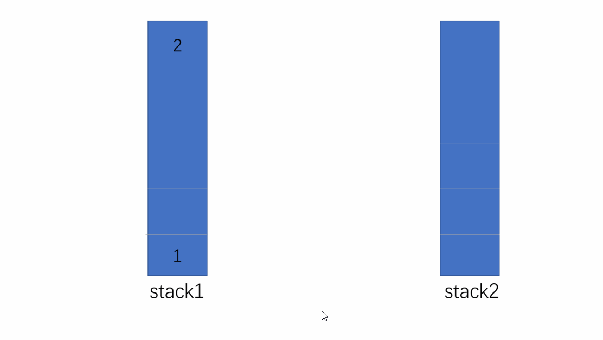

[原题地址](https://leetcode-cn.com/problems/implement-queue-using-stacks/)

使用栈实现队列的下列操作：

- push(x) -- 将一个元素放入队列的尾部。
- pop() -- 从队列首部移除元素。
- peek() -- 返回队列首部的元素。
- empty() -- 返回队列是否为空。
 

示例:
```md
MyQueue queue = new MyQueue();

queue.push(1);
queue.push(2);  
queue.peek();  // 返回 1
queue.pop();   // 返回 1
queue.empty(); // 返回 false
```
:::tip
说明:
- 你只能使用标准的栈操作 -- 也就是只有 push to top, peek/pop from top, size, 和 is empty 操作是合法的。
- 你所使用的语言也许不支持栈。你可以使用 list 或者 deque（双端队列）来模拟一个栈，只要是标准的栈操作即可。
- 假设所有操作都是有效的 （例如，一个空的队列不会调用 pop 或者 peek 操作）。
:::

## 分析
如果不是限制只能用栈来实现的话，这题太简单不过了，直接调用js的api就能完成，但是这题限制了条件，只能用栈来实现。

栈是一种后进先出的数据结构，类似于家里的叠盘子，最后放进去的，最先被取出来，浏览器的前进后退功能也是用栈实现的，只支持从尾部进(push)和出(pop)。

简单介绍了栈后，说一下这题思路：
- 1、维护两个栈stack1、stack2。
- 2、遇到push操作时，推入stack1中。
- 3、遇到pop或者peek时，将stack1中的数据一个个出栈。然后在入栈stack2，这样stack2就是stack1的反转，获取stack1首部元素的时候，stack2直接出栈就行。

动图展示如下：


## 实现代码
```js
/**
 * Initialize your data structure here.
 */
var MyQueue = function () {
  this.stack1 = [];
  this.stack2 = [];
};

/**
 * Push element x to the back of queue.
 * @param {number} x
 * @return {void}
 */
MyQueue.prototype.push = function (x) {
  this.stack1.push(x);
};

/**
 * Removes the element from in front of queue and returns that element.
 * @return {number}
 */
MyQueue.prototype.pop = function () {
  // 先判断stack2中是否有元素，有就直接出
  if (this.stack2.length > 0) {
    return this.stack2.pop();
  } else {
    // 没有就将stack1中的元素移入stack2中，然后在从stack2中出
    let stack1 = this.stack1;
    while (stack1.length > 0) {
      this.stack2.push(stack1.pop());
    }
    return this.stack2.pop();
  }
};

/**
 * Get the front element.
 * @return {number}
 */
MyQueue.prototype.peek = function () {
  // 和上面的pop同理
  if (this.stack2.length > 0) {
    return this.stack2[this.stack2.length - 1];
  } else {
    let stack1 = this.stack1;
    while (stack1.length > 0) {
      this.stack2.push(stack1.pop());
    }
    return this.stack2[this.stack2.length - 1];
  }
};

/**
 * Returns whether the queue is empty.
 * @return {boolean}
 */
MyQueue.prototype.empty = function () {
  // stack1和stack2同时都为空，说明整个队列才为空
  if (this.stack1.length === 0 && this.stack2.length === 0) {
    return true;
  } else {
    return false;
  }
};

/**
 * Your MyQueue object will be instantiated and called as such:
 * var obj = new MyQueue()
 * obj.push(x)
 * var param_2 = obj.pop()
 * var param_3 = obj.peek()
 * var param_4 = obj.empty()
 */

// 执行用时：68 ms, 在所有 JavaScript 提交中击败了59.39%的用户
// 内存消耗：32.3 MB, 在所有 JavaScript 提交中击败了100.00%的用户
// 时间复杂度：On （数据搬移）
// 空间复杂度：On
```
