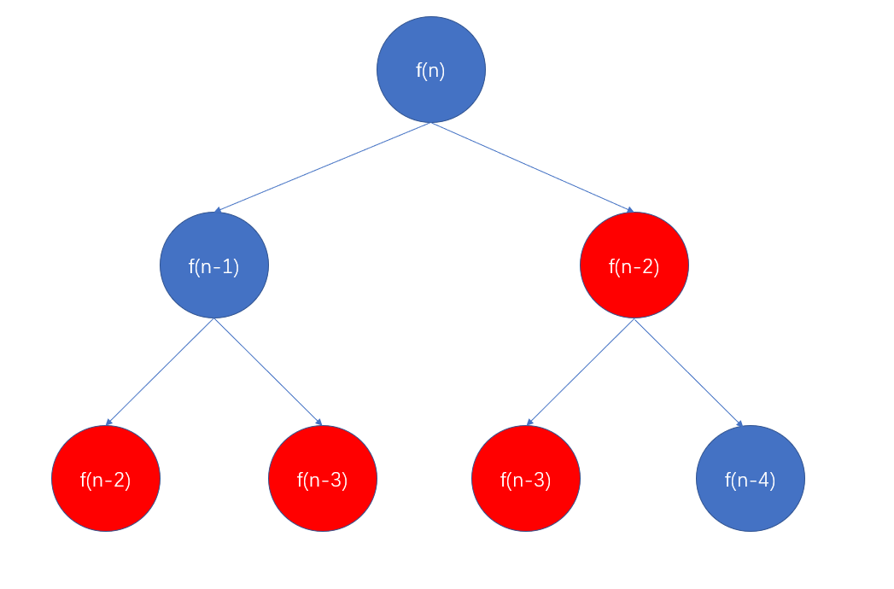

[原题地址](https://leetcode-cn.com/problems/climbing-stairs/)

假设你正在爬楼梯。需要 n 阶你才能到达楼顶。

每次你可以爬 1 或 2 个台阶。你有多少种不同的方法可以爬到楼顶呢？

注意：给定 n 是一个正整数。

示例 1：
```md
输入： 2
输出： 2
解释： 有两种方法可以爬到楼顶。
1.  1 阶 + 1 阶
2.  2 阶
```
示例 2：
```md
输入： 3
输出： 3
解释： 有三种方法可以爬到楼顶。
1.  1 阶 + 1 阶 + 1 阶
2.  1 阶 + 2 阶
3.  2 阶 + 1 阶
```

## 思考
这题我第一反应是用递归，把爬楼梯问题转换成下楼梯，从n阶楼梯往下走，每次一步或两步，有多少种走法。

先根据下楼梯写出递归公式: `fn(n) = fn(n-1) + f(n-2)`, 具体代码如下：
```js
var climbStairs = function (n) {
  if (n === 1) {
    return 1;
  }
  if (n === 2) {
    return 2;
  }
  // 递归公式
  return climbStairs(n - 1) + climbStairs(n - 2)
};
```
美滋滋去一测试，显示超出时间限制，我就有点懵逼，仔细分析了一下超时的原因，就是重复结算，为啥会发生重复计算，看下图：<br/>


标红的地方都有重复计算，因为我们并没有吧计算结果存起来，越往下重复计算越严重，这也是上面写法会最终超时的原因。

既然有重复，那我们吧每次计算的值都存起来，每次递归前判断一下，要是有有直接拿出来，这样不就OK了。
```js
// 缓存以计算过的结果
const hash = {};
var climbStairs = function (n) {
  if (n === 1) {
    return 1;
  }
  if (n === 2) {
    return 2;
  }
  // 如果这个值没第一次计算，就放入缓存hash结果中。
  if (hash[n] === undefined) {
    return (hash[n] = climbStairs(n - 1) + climbStairs(n - 2));
  }
  // 走到这里，说明hash中存在结果，那就直接返回结果，不用重复结算了
  return hash[n];
};
// 执行用时：84 ms, 在所有 JavaScript 提交中击败了22.60%的用户
// 内存消耗：37.5 MB, 在所有 JavaScript 提交中击败了62.67%的用户
```
一跑，果然通过了，但这不是这题最终结果，这题最终是要考察动态规划，下面了解了解动态规划的解法，自己对比一下。

## 解题
如果说递归是从上往下，那么动态规划就是从下往上，从已知的角度，一步步向前推到，进而求出解，看代码：
```js
var climbStairs = function (n) {
  const f = {};
  f[1] = 1;
  f[2] = 2;
  // 动态更新每层楼的结果
  for (let i = 3; i <= n; i++) {
    f[i] = f[i - 1] + f[i - 2];
  }
  return f[n];
};
// 执行用时：80 ms, 在所有 JavaScript 提交中击败了31.09%的用户
// 内存消耗：36.9 MB, 在所有 JavaScript 提交中击败了98.23%的用户
```
## 总结
上面这题算是动态规划题的小试牛刀，代码也很好理解。