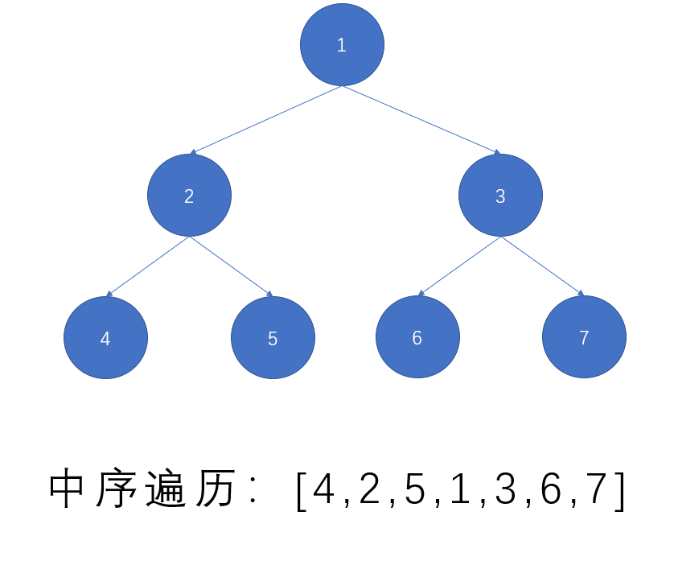

[原题地址](https://leetcode-cn.com/problems/binary-tree-inorder-traversal/)

给定一个二叉树，返回它的中序 遍历。

示例:
```md
输入: [1,null,2,3]
   1
    \
     2
    /
   3

输出: [1,3,2]
```
## 分析
看这题之前最好先看看[144.二叉树的前序遍历](./144.二叉树的前序遍历)，相比前序遍历来说，中序遍历有点麻烦，需要先获取到最左子树
，看如下示意图：


从根节点向下遍历，将左字树推入栈，遍历结束后，栈尾元素就是最左字树(上图4)。

## 实现代码
```js
/**
 * Definition for a binary tree node.
 * function TreeNode(val) {
 *     this.val = val;
 *     this.left = this.right = null;
 * }
 */
/**
 * @param {TreeNode} root
 * @return {number[]}
 */
var inorderTraversal = function (root) {
  // 结果集
  const result = [];
  // 调用栈
  const stack = [];
  // 游标
  let cur = root;
  while (cur || stack.length) {
    // 寻找最左字树
    while (cur) {
      stack.push(cur);
      cur = cur.left;
    }
    cur = stack.pop();
    result.push(cur.val);
    // 读取右子树
    cur = cur.right;
  }
  return result;
};
// 执行用时：92 ms, 在所有 JavaScript 提交中击败了5.87%的用户
// 内存消耗：37.8 MB, 在所有 JavaScript 提交中击败了6.67%的用户
// 时间复杂度：On * m  (m:左字树深度)
// 空间复杂度：On
```