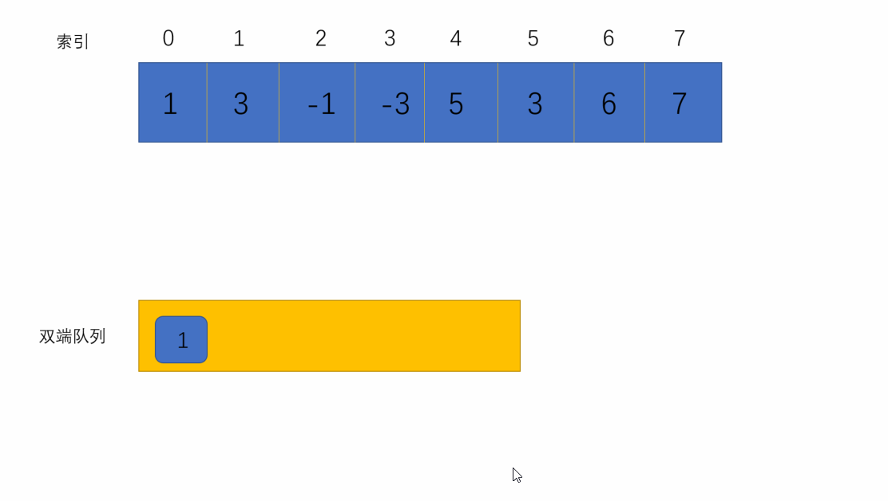

[原题地址](https://leetcode-cn.com/problems/hua-dong-chuang-kou-de-zui-da-zhi-lcof/)

给定一个数组 nums 和滑动窗口的大小 k，请找出所有滑动窗口里的最大值。

示例:
```md
输入: nums = [1,3,-1,-3,5,3,6,7], 和 k = 3
输出: [3,3,5,5,6,7] 
解释: 

  滑动窗口的位置                最大值
---------------               -----
[1  3  -1] -3  5  3  6  7       3
 1 [3  -1  -3] 5  3  6  7       3
 1  3 [-1  -3  5] 3  6  7       5
 1  3  -1 [-3  5  3] 6  7       5
 1  3  -1  -3 [5  3  6] 7       6
 1  3  -1  -3  5 [3  6  7]      7
```

提示：

你可以假设 k 总是有效的，在输入数组不为空的情况下，1 ≤ k ≤ 输入数组的大小。

## 解题
解法一：Math.max获取最大值
```js
var maxSlidingWindow = function (nums, k) {
  // 处理nums=[]这种情况
  if (nums.length <= 1) return nums;
  let arr = [];
  for (let i = 0; i < nums.length - k + 1; i++) {
    // 按照k的大小切割nums数组
    let list = nums.slice(i, i + k);
    // 获取数组最大值push进结果数组中
    arr.push(Math.max(...list));
  }
  return arr;
};
// 执行用时：196 ms, 在所有 JavaScript 提交中击败了36.81%的用户
// 内存消耗：47.1 MB, 在所有 JavaScript 提交中击败了100.00%的用户
// 时间复杂度：O(n*k) list的长度为k，Math.max查找复杂度就是k
// 空间复杂度：Ok
```
这题做完感觉太简单了，就去评论区翻了翻，发现了下面这种接法。<br />
解法二：双端队列
简单画个动图如下：

```js
var maxSlidingWindow = function (nums, k) {
  // 结果数组
  const result = [];
  // 双端队列
  const deque = [];
  for (let i = 0; i < nums.length; i++) {
    while (deque.length && nums[i] > nums[deque[deque.length - 1]]) {
      // 如果当前元素大于队尾元素，队尾出队
      deque.pop();
    }
    // 入队
    deque.push(i);

    // 当队头索引小于当前索引-k时
    while (deque.length && deque[0] <= i - k) {
      deque.shift();
    }
    // 当被遍历的数大于k时。队头元素（队列中的最大元素）push进结果数组
    if (i >= k - 1) {
      result.push(nums[deque[0]]);
    }
  }
  return result;
};
// 执行用时：120 ms, 在所有 JavaScript 提交中击败了75.84%的用户
// 内存消耗：41.7 MB, 在所有 JavaScript 提交中击败了100.00%的用户
// 时间复杂度：On
// 空间复杂度：On
```
如果平时工作中遇到这种情景，大部分情况下推荐第一张写法，简单明了。如果对性能有较高要求的话，才推荐第二种。
