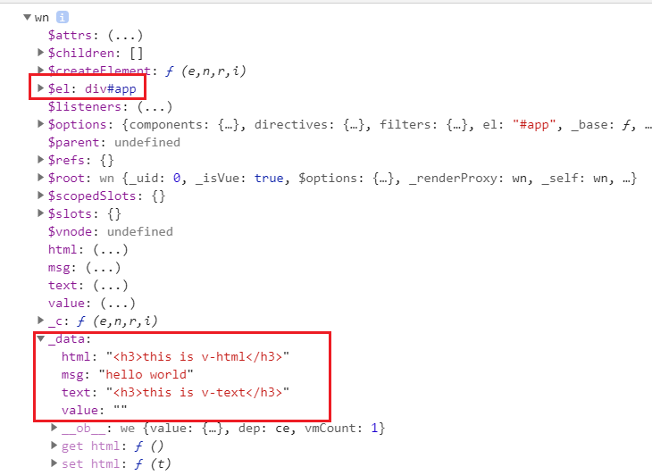
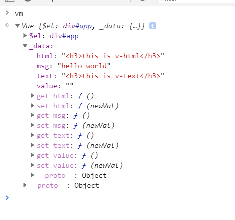
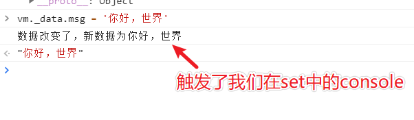

说一下`vue`的响应式原理，这是一道很经典的面试题，学过`vue`的，或者说专门准备过`vue`面试的，对这道题或多或少都会有一些理解。

有些人会知道，`vue`响应式原理的核心就是通过`Object.defineProperty`这个api来实现的，但是可能对于内部具体的实现原理不是太清楚，这节我就一点一点的带你理清`vue`中响应式的实现方式。

## 从结果出发
我们在初始化`vue`的时候，都是通过`new Vue({})`,传入一个对象来实现的。我们通过cdn引入`vue`，并且将vm实例打印出来看看具体都有些什么。
```html
<!-- 通过cdn引入vue -->
<script src="https://cdn.jsdelivr.net/npm/vue@2.6.11"></script>
<script>
  let vm = new Vue({
    el: "#app",
    data: {
      msg: "hello world",
      html: "<h3>this is v-html</h3>",
      text: "<h3>this is v-text</h3>",
      value: "",
    },
  });
  console.log(vm)
</script>
```
打印出的vm有很多属性，我们重点关注图中标红的两个地方<br/>

对照代码如下：
```js
class Vue {
  constructor(options) {
    this.$el = options.el ? document.querySelector(options.el) : '';
    this._data = options.data;
  }
}
```

现在`data`中的数据有了，下一步就是如何将其变为响应式数据。代码如下，我配一些注释，很好理解：
```js
class Vue {
  constructor(options) {
    this.$el = options.el ? document.querySelector(options.el) : "";
    this._data = options.data || [];

    this.observer(this._data);
  }

  observer(data) {
    if(!data || typeof data !== 'object') {
      return
    }
    // 遍历data对象
    Object.keys(data).forEach((key) => {
      this.defineReactive(data, key, data[key]);
    });
  }
  // 数据响应式
  defineReactive(data, key, value) {
    // 如果value类型是object就会自动进行递归
    this.observer(value)
    // 不熟悉下面这个方法的可以去mdn看一下解释
    // https://developer.mozilla.org/zh-CN/docs/Web/JavaScript/Reference/Global_Objects/Object/defineProperty
    Object.defineProperty(data, key, {
      enumerable: true,
      configurable: true,
      get: function () {
        // 注意：这里不能用data[key]来替代value，因为这样用就又会触发get方法，形成死循环
        return value;
      },
      set: function (newVal) {
        // 如果前后值相等就直接return
        if (newVal === value) {
          return;
        }
        console.log(`数据改变了，新数据为${newVal}`);
        value = newVal;
      },
    });
  }
}
```

测试看一下效果：


改变一下数据看看：



## 总结
以上代码就实现了简单的数据响应式，但是瑕疵很多，比如我们在日常开发中获取`data`中的数据，都是直接通过`this.msg`这种方式获取，但上面这种需要通过`vm._data.msg`才能获取到，中间夹杂了一个`_data`，下一节我们就要讲如何将`_data`中的数据代理到Vue实例中，方便我们更好的操作数据