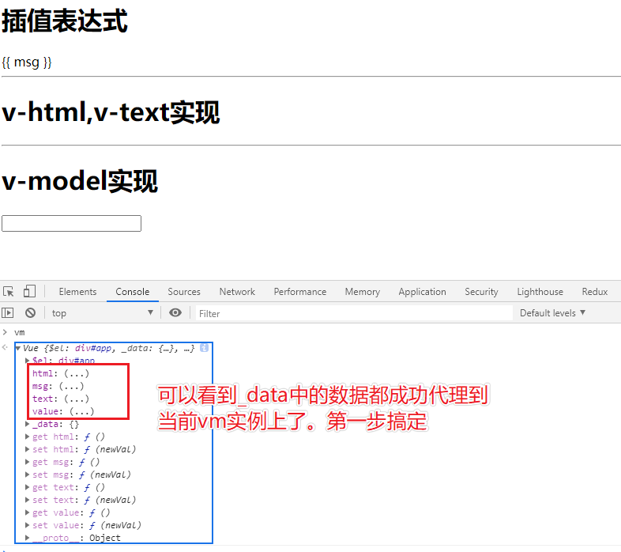
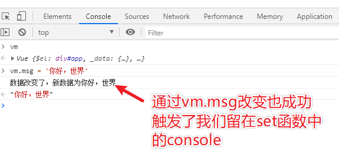

上节中我们访问响应式数据的时候，需要通过vm._data.xxx来访问到，这节简化一下数据获取方法，直接通过vm.xxx获取。

## _proxyData方法实现
```js
class Vue {
  constructor(options) {
    // ...
    this._data = options.data || [];
    this._proxyData(this._data);
  }

  _proxyData(data) {
    Object.keys(data).forEach(key => {
      // 将key注入到当前this对象中
      Object.defineProperty(this, key, {
        enumerable: true,
        configurable: true,
        get: function() {
          // 注意这里要用data[key]来获取value，要和上面defineReactive方法中的get区分开了
          // 为什么是data[key]：这里有人可能会乱，怎么一会用value，一会用data[key]，原因是我们这里只是做一层代理，你通过vm.xxx获取其实内部就是去将this._data中的数据取出来给你，往引用上想一想就明白了。
          return data[key];
        },
        set: function(newVal) {
          if(newVal === data[key]) {
            return;
          }
          data[key] = newVal
        }
      })
    })
  }
}
```

## 完整代码
```js
class Vue {
  constructor(options) {
    this.$el = options.el ? document.querySelector(options.el) : "";
    this._data = options.data || [];

    this.observer(this._data);
    this.initProxy(this._data);
  }

  observer(data) {
    // 遍历data对象
    Object.keys(data).forEach((key) => {
      this.defineReactive(data, key, data[key]);
    });
  }
  // 数据响应式
  defineReactive(data, key, value) {
    // 不熟悉下面这个方法的可以去mdn看一下解释
    // https://developer.mozilla.org/zh-CN/docs/Web/JavaScript/Reference/Global_Objects/Object/defineProperty
    Object.defineProperty(data, key, {
      enumerable: true,
      configurable: true,
      get: function () {
        // 注意：这里不能用data[key]来替代value，因为这样用就又会触发get方法，形成死循环
        return value;
      },
      set: function (newVal) {
        // 如果前后值相等就直接return
        if (newVal === value) {
          return;
        }
        console.log(`数据改变了，新数据为${newVal}`);
        value = newVal;
      },
    });
  }

  initProxy(data) {
    Object.keys(data).forEach((key) => {
      // 将key注入到当前this对象中
      Object.defineProperty(this, key, {
        enumerable: true,
        configurable: true,
        get: function () {
          // 注意这里要用data[key]来获取value，要和上面defineReactive方法中的get区分开了
          // 为什么是data[key]：这里有人可能会乱，怎么一会用value，一会用data[key]，原因是我们这里只是做一层代理，你通过vm.xxx获取其实内部就是去将this._data中的数据取出来给你，往引用上想一想就明白了。
          return data[key];
        },
        set: function (newVal) {
          if (newVal === data[key]) {
            return;
          }
          data[key] = newVal;
        },
      });
    });
  }
}
```

## 优化
上面我们吧所有逻辑都放到了一个class类中，这样乱糟糟的肯定不行，下面就需要按照功能将其分到不同的文件中<br/>
`proxy.js`
```js
class InitProxy {
  constructor(vm) {
    this.$vm = vm;
    this.$data = vm._data;
    this.proxy(this.$data);
  }

  proxy(data) {
    Object.keys(data).forEach((key) => {
      // 将key注入到当前this对象中
      Object.defineProperty(this.$vm, key, {
        enumerable: true,
        configurable: true,
        get: function () {
          // 注意这里要用data[key]来获取value，要和上面defineReactive方法中的get区分开了
          // 为什么是data[key]：这里有人可能会乱，怎么一会用value，一会用data[key]，原因是我们这里只是做一层代理，你通过vm.xxx获取其实内部就是去将this._data中的数据取出来给你，往引用上想一想就明白了。
          return data[key];
        },
        set: function (newVal) {
          if (newVal === data[key]) {
            return;
          }
          data[key] = newVal;
        },
      });
    });
  }
}
```
注意：Object.defineProperty(this.$vm, key, {})将之前的this改为this.$vm。

`observer.js`
```js
class Observer {
  constructor(data) {
    this.walk(data);
  }
  // 这里把observer方法换个名字，换成walk
  walk(data) {
    // 边界条件判断，同时也是递归的结束条件
    if (!data || typeof data !== "object") {
      return;
    }
    // 遍历data对象
    Object.keys(data).forEach((key) => {
      this.defineReactive(data, key, data[key]);
    });
  }
  // 数据响应式
  defineReactive(data, key, value) {
    // 如果value类型是object就会自动进行递归
    this.walk(value);
    // 不熟悉下面这个方法的可以去mdn看一下解释
    // https://developer.mozilla.org/zh-CN/docs/Web/JavaScript/Reference/Global_Objects/Object/defineProperty
    Object.defineProperty(data, key, {
      enumerable: true,
      configurable: true,
      get: function () {
        // 注意：这里不能用data[key]来替代value，因为这样用就又会触发get方法，形成死循环
        return value;
      },
      set: function (newVal) {
        // 如果前后值相等就直接return
        if (newVal === value) {
          return;
        }
        console.log(`数据改变了，新数据为${newVal}`);
        value = newVal;
      },
    });
  }
}
```

`vue.js`
```js
class Vue {
  constructor(options) {
    this.$el = options.el ? document.querySelector(options.el) : "";
    this._data = options.data || [];

    new Observer(this._data);
    new InitProxy(this);
  }
}
```

`index.html`
```html
<!DOCTYPE html>
<html lang="en">
  <head>
    <meta charset="UTF-8" />
    <meta name="viewport" content="width=device-width, initial-scale=1.0" />
    <title>Document</title>
  </head>
  <body>
    <div id="app">
      <h1>插值表达式</h1>
      <span>{{ msg }}</span>
      <hr />
      <h1>v-html,v-text实现</h1>
      <div v-html="html"></div>
      <div v-text="text"></div>
      <hr />
      <h1>v-model实现</h1>
      <input type="text" v-model="value" />
    </div>

    <!-- 注意，observer.js、proxy.js这俩文件必须在vue.js这文件之前引入 -->
    <script src="./observer.js"></script>
    <script src="./proxy.js"></script>
    <script src="./vue.js"></script>
    <script>
      let vm = new Vue({
        el: "#app",
        data: {
          msg: "hello world",
          html: "<h3>this is v-html</h3>",
          text: "<h3>this is v-text</h3>",
          value: "",
        },
      });
    </script>
  </body>
</html>
```

## 测试
按照上面分完组件后，整体代码功能就比之前清晰多了，现在来测试一下功能。在浏览器打开index.html。




## 总结
这里我们已经实现了基本的两步，代理和数据响应式，下一节就该对html的模板进行解析。