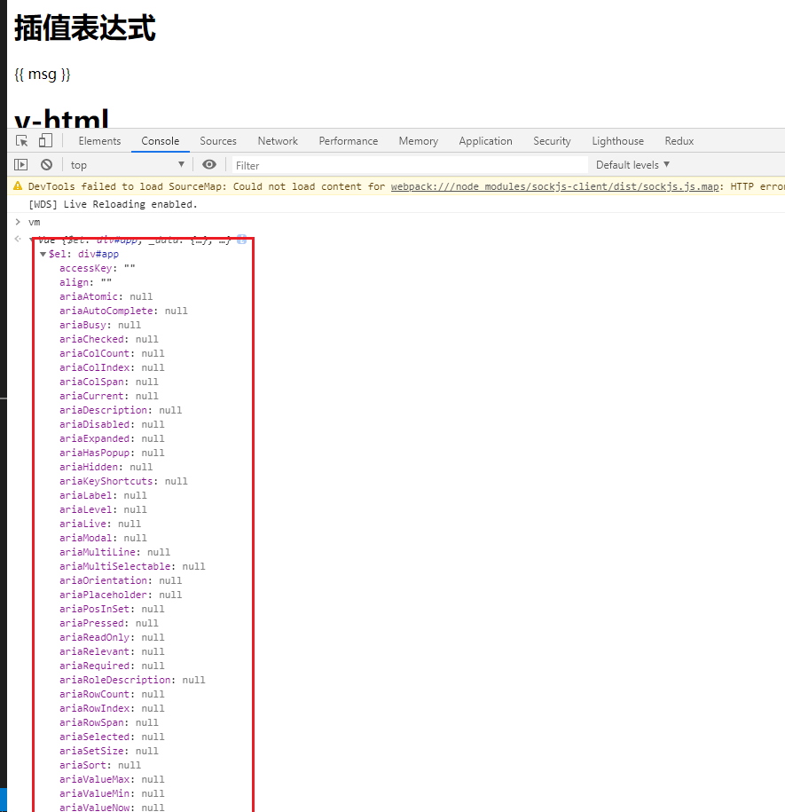
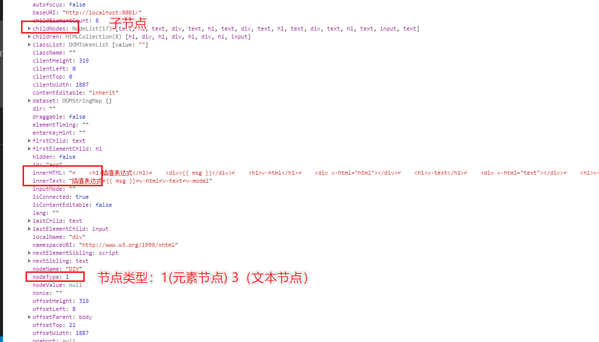
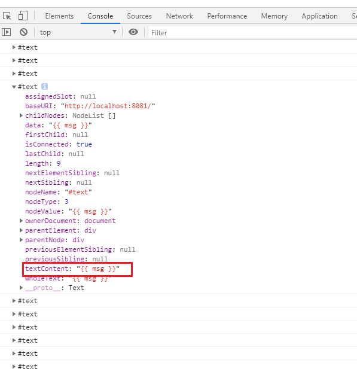
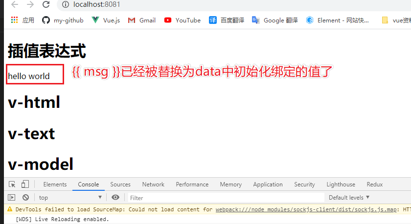
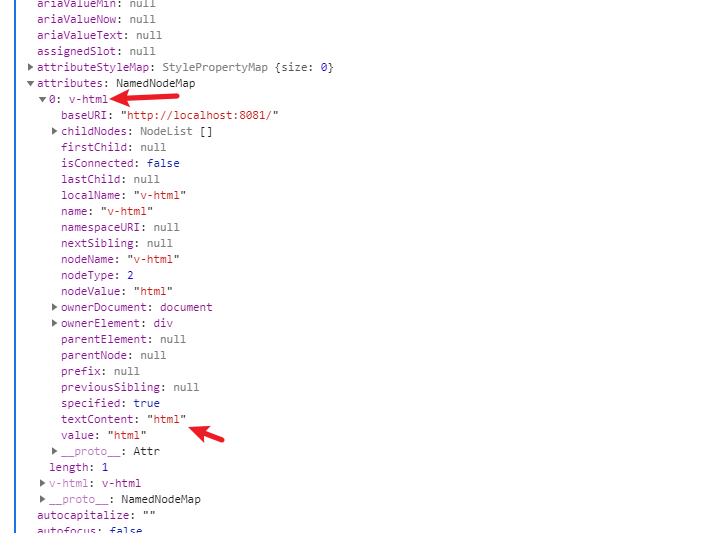
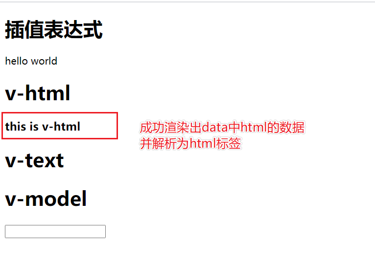
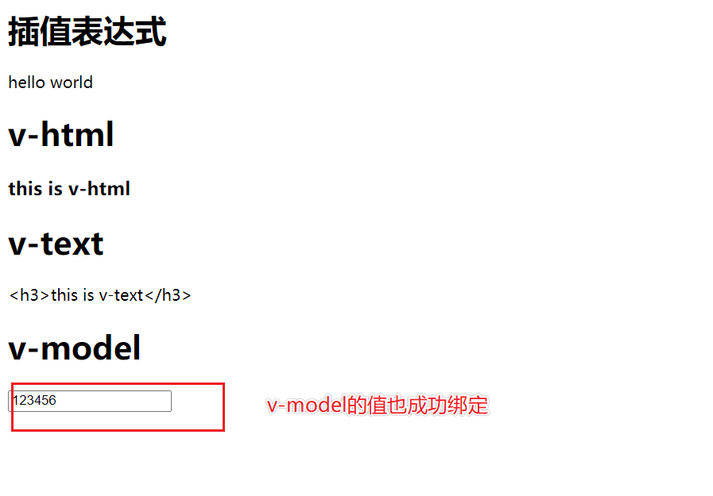

[源码地址](https://github.com/xiaofeng-bm/mini-vue)


我们在写vue组件的模板`template`时，会参杂一些vue特有的语法进去，比如{{}}、v-html、v-model等等。这些东西浏览器肯定是不认识的，这节就来实现一下这几个功能。

## 前置知识
我们前面在vm实例中挂了一个$el，一直也没管它，这节就要用到它了。<br/>

在`src/index.html`中加入以下内容:
```html
<!DOCTYPE html>
<html lang="en">
<head>
  <meta charset="UTF-8">
  <meta name="viewport" content="width=device-width, initial-scale=1.0">
  <title>Document</title>
</head>
<body>
  <div id="app">
    <!-- 添加的内容 -->
    <h1>插值表达式</h1>
    <div>{{ msg }}</div>
    <h1>v-html</h1>
    <div v-html="html"></div>
    <h1>v-text</h1>
    <div v-text="text"></div>
    <h1>v-model</h1>
    <input type="text" v-model="value">
  </div>
</body>
</html>
```
npm run dev启动后在控制台打印vm，信息如下：


重点需要关注下图，以及`attributes`、`textContent`属性：



## 思路分析
我们前面通过`#app`获取到了整个`#app`元素以及其子元素，循环其子元素进行解析，处理等：
- 1、通过`document.querySelector(options.el)`获取`id`为`app`的元素，并挂载到$el属性上。
- 2、通过$el.childNodes获取其子节点。
- 3、循环子节点，通过nodeType判断节点类型，1为元素节点，3为文本节点
- 4、编译文本节点和元素节点。

## 实现代码
`src/core`下新增`compiler.js`文件，先将基本方法写入：
```js
class Compiler {
  constructor(vm) {
    this.vm = vm;
    this.el = vm.$el;

    this.compiler(this.el);
  }

  compiler(el) {
    // 获取子元素（注意：子元素是一个类数组，不是真数组，所以下面需要用Array.from转成数组）
    let childNodes = el.childNodes;
    Array.from(childNodes).forEach((node) => {
      // 判断文本节点
      if (this.isTextNode(node)) {
        // 编译文本节点
        this.complierText(node);
      } else if (this.isElementNode(node)) {
        // 编译元素节点
        this.complieElement(node);
      }

      // 判断node节点是否有子节点，如果有，需要递归调用compile
      if (node.childNodes && node.childNodes.length) {
        this.compiler(node);
      }
    });
  }
  // 文本节点判断
  isTextNode(node) {
    // nodeType：3代表文本节点
    return node.nodeType === 3;
  }
  // 元素节点判断
  isElementNode(node) {
    // nodeType：1代表元素节点
    return node.nodeType === 1;
  }
  // 编译元素节点
  complieElement(node) {
    // todo
  }
  // 编译文本节点
  complierText(node) {}
}
export default Compiler;
```
写完后，在`vue.js`中导入去浏览器看看有没有报错：
```js
import { proxy } from "./proxy";
import { observer } from "./observer";
import Compiler from "./compiler";

class Vue {
  constructor(options) {
    // 1、通过属性保存选项的数据
    this.$el = options.el ? document.querySelector(options.el) : "";
    this._data = options.data;
    observer(this._data);
    proxy(this);
    // 编译
    new Compiler(this);
  }
}

export default Vue;
```


## complierText
我们先来处理文本节点，主要是处理差值表达式`\{\{ msg \}\}`，让其渲染data中绑定的msg内容，在complierText中打印元素：
```js
complierText(node) {
  // 注意这里用dir，不要用log
  console.dir(node)
}
```


我们要干的就是把`textContent`替换成真实绑定的值，我将整个函数完整列出，加上注释：
```js
// 编译文本节点
complierText(node) {
  // 这里涉及到正则解析字符串，不懂的可以先去看看我正则的那篇博客
  // http://shiluyue.xyz/blog/blog/JS/RegExp.html
  const reg = /\{\{(.+?)\}\}/;
  // value = {{ msg }}
  let value = node.textContent;
  // 判断是否为差值表达式，既{{}}
  if (reg.test(value)) {
    // 这里会获取到上面reg括号中的内容，既 msg ,注意我们写的时候一般双大括号中间都会加空格，这里需要用trim去掉空格
    let key = RegExp.$1.trim(); // key = msg;
    // 这里用replace直接替换为Vue实例中msg实际的值，通过this.vm[key]='hello world'
    node.textContent = value.replace(reg, this.vm[key]);
  }
}
```
这里涉及到正则表达式的很多内容，Vue源码中模板解析也用到了大量的正则表达式，所以需要好好了解学习一下。

回到浏览器看效果如下：



## complieElement
在来看重头戏，如何编译元素节点，这里内容有点多，我一步步说：

首先我们要知道，这种v-if、v-html、v-model这种指令，写在了元素内部，我们知道写在html标签内部的都叫属性，我们打印出来看一下:
```js
// 编译元素节点
complieElement(node) {
  console.dir(node)
}
```


如何解析v-html这个指令呢，我们目标就是取到`v-html="html"`这个指令中的内容，然后通过`Vue[html]`获取到实际内容，在将元素的`innerHTML`替换就`OK`了，具体代码如下：
```js
// 编译元素节点
complieElement(node) {
  // console.dir(node) // 调试
  Array.from(node.attributes).forEach(attr => {
    // attrName = 'v-html' 
    let attrName = attr.name;
    // 判断是否为指令，v-开头就认为是vue指令
    if(this.isDirective(attrName)) {
      // 获取指令内容
      let key = attr.value;
      if(attrName === 'v-html') {
        this.htmlUpdater(node, this.vm[key]);
      }
    }
  })
}
// 更新html
htmlUpdater(node, value) {
  node.innerHTML = value;
}
// 是否为元素指令
isDirective(attrName) {
  return attrName.startsWith('v-');
}
```
效果如下：



如果你能看懂上面v-html的解析，那v-text就很简单了，代码如下：
```js
// 编译元素节点
complieElement(node) {
  // ...
  if(attrName === 'v-html') {
    this.htmlUpdater(node, this.vm[key]);
  } else if(attrName === 'v-text') {
    this.textUpdater(node, this.vm[key])
  }
}
// 更新text
textUpdater(node, value) {
  node.textContent = value;
}
```

接下来在渲染v-model，代码如下：
```js
// 编译元素节点
complieElement(node) {
  // ...
  if(attrName === 'v-html') {
    this.htmlUpdater(node, this.vm[key]);
  } else if(attrName === 'v-text') {
    this.textUpdater(node, this.vm[key])
  } else if(attrName === 'v-model') {
    this.modelUpdater(node, this.vm[key])
  }
}
// 更新v-model
modelUpdater(node, value) {
  node.value = value;
}
```
修改`src/main.js`中data下的`value: '123456'`。

效果如下：



至此我们完成了差值表达式`{{}}`、`v-html`、`v-text`、`v-model`的解析。

## 代码优化
上面代码`complieElement`函数有一些不太完美的地方，我们判断节点类型是通过`if`来判断的，这样几个还好，但是我们知道，`vue`指令少说也有十几个，在加上项目中的自定义指令啥的，加起来的写好多个`if else`，不优美，我们在项目中也经常会遇到if判断写太多，`vue`源码中用一种很优美的方式来优化了这种多层次`if`嵌套的问题，下面直接看代码：
```js
// 编译元素节点
complieElement(node) {
  // console.dir(node); // 调试
  Array.from(node.attributes).forEach((attr) => {
    // attrName = 'v-html'
    let attrName = attr.name;
    // 判断是否为指令，v-开头就认为是vue指令
    if (this.isDirective(attrName)) {
      // 获取指令内容
      let key = attr.value;
      // v-html -> html, v-text -> text
      attrName = attrName.substring(2);
      // 通过下面这个函数处理，就不用写那么多的if判断了
      this.update(node, key, attrName);
      // if(attrName === 'v-html') {
      //   this.htmlUpdater(node, this.vm[key]);
      // } else if(attrName === 'v-text') {
      //   this.textUpdater(node, this.vm[key])
      // } else if(attrName === 'v-model') {
      //   this.modelUpdater(node, this.vm[key])
      // }
    }
  });
}
// 更新函数(画重点)
update(node, key, attrName) {
  // attrName 为html、text、model等
  // 通过做字符串拼接，拼成htmlUpdater、textUpdater、modelUpdater等等。
  // 然后通过this[name]的方式获取到相应的函数，在执行。
  // 这样做的好处是，你有新的指令，complieElement根本不用动，
  // 你只需要按照规则添加新的指令解析函数就行，保持了设计模式种的开放封闭原则。
  let updateFn = this[attrName + "Updater"];
  updateFn && updateFn(node, this.vm[key]);
}
// 更新v-html
htmlUpdater(node, value) {
  node.innerHTML = value;
}
// 更新v-text
textUpdater(node, value) {
  node.textContent = value;
}
// 更新v-model
modelUpdater(node, value) {
  node.value = value;
}
```
自己理解上面`update`函数的妙用，将来在日常组件开发中，如果遇到类似情况的可以用这种方法来解决`if`嵌套问题。

## 完整代码
```js
// 这里为啥用class类，而不写成普通函数，后面会说明
class Compiler {
  constructor(vm) {
    this.vm = vm;
    this.el = vm.$el;

    this.compiler(this.el);
  }

  compiler(el) {
    // 获取子元素（注意：子元素是一个类数组，不是真数组，所以下面需要用Array.from转成数组）
    let childNodes = el.childNodes;
    Array.from(childNodes).forEach((node) => {
      // 判断文本节点
      if (this.isTextNode(node)) {
        // 编译文本节点
        this.complierText(node);
      } else if (this.isElementNode(node)) {
        // 编译元素节点
        this.complieElement(node);
      }

      // 判断node节点是否有子节点，如果有，需要递归调用compile
      if (node.childNodes && node.childNodes.length) {
        this.compiler(node);
      }
    });
  }

  // 编译元素节点
  complieElement(node) {
    // console.dir(node); // 调试
    Array.from(node.attributes).forEach((attr) => {
      // attrName = 'v-html'
      let attrName = attr.name;
      // 判断是否为指令，v-开头就认为是vue指令
      if (this.isDirective(attrName)) {
        // 获取指令内容
        let key = attr.value;
        // v-html -> html, v-text -> text
        attrName = attrName.substring(2);
        // 通过下面这个函数处理，就不用写那么多的if判断了
        this.update(node, key, attrName);
        // if(attrName === 'v-html') {
        //   this.htmlUpdater(node, this.vm[key]);
        // } else if(attrName === 'v-text') {
        //   this.textUpdater(node, this.vm[key])
        // } else if(attrName === 'v-model') {
        //   this.modelUpdater(node, this.vm[key])
        // }
      }
    });
  }

  // 编译文本节点
  complierText(node) {
    // 这里涉及到正则解析字符串，不懂的可以先去看看我正则的那篇博客
    // http://shiluyue.xyz/blog/blog/JS/RegExp.html
    const reg = /\{\{(.+?)\}\}/;
    // value = {{ msg }}
    let value = node.textContent;
    // 判断是否为差值表达式，既{{}}
    if (reg.test(value)) {
      // 这里会获取到上面reg括号中的内容，既 msg ,注意我们写的时候一般双大括号中间都会加空格，这里需要用trim去掉空格
      let key = RegExp.$1.trim(); // key = msg;
      // 这里用replace直接替换为Vue实例中msg实际的值，通过this.vm[key]='hello world'
      node.textContent = value.replace(reg, this.vm[key]);
    }
  }
  // 更新函数(画重点)
  update(node, key, attrName) {
    // attrName 为html、text、model等
    // 通过做字符串拼接，拼成htmlUpdater、textUpdater、modelUpdater等等。
    // 然后通过this[name]的方式获取到相应的函数，在执行。
    // 这样做的好处是，你有新的指令，complieElement根本不用动，
    // 你只需要按照规则添加新的指令解析函数就行，保持了设计模式种的开放封闭原则。
    let updateFn = this[attrName + "Updater"];
    updateFn && updateFn(node, this.vm[key]);
  }
  // 更新v-html
  htmlUpdater(node, value) {
    node.innerHTML = value;
  }
  // 更新v-text
  textUpdater(node, value) {
    node.textContent = value;
  }
  // 更新v-model
  modelUpdater(node, value) {
    node.value = value;
  }

  // 是否为元素指令
  isDirective(attrName) {
    return attrName.startsWith("v-");
  }

  // 文本节点判断
  isTextNode(node) {
    // nodeType：3代表文本节点
    return node.nodeType === 3;
  }
  // 元素节点判断
  isElementNode(node) {
    // nodeType：1代表元素节点
    return node.nodeType === 1;
  }
}
export default Compiler;
```

## 总结
目前我们实现了模板编译，也实现了一些指令解析，如v-html、v-text、v-model等，你可以想想如v-if这种如何处理。

另外我们写了一大堆代码才实现了几个元素的解析，从效率上来说，还不如我直接修改DOM来的块，下一节我们将添加观察者模式，实现监听到数据变化后，自动更新DOM的机制。