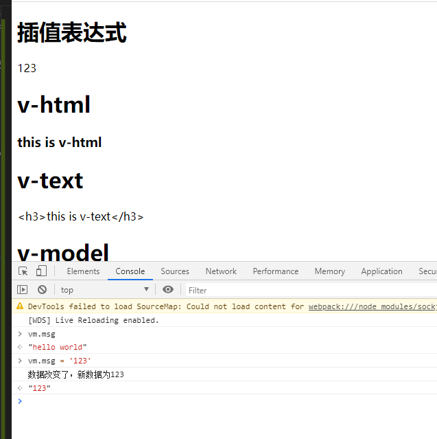

[源码地址](https://github.com/xiaofeng-bm/mini-vue)

这节我们来看vue的真正核心，`响应式原理`前面在第二节`observer响应式`中我们已经可以监听到数据的变化，这节要做的就是当数据变化后，如何自动更新DOM。

看之前可以先去vue官网看一下官网[响应式原理](https://cn.vuejs.org/v2/guide/reactivity.html)这一章节。

## 观察者模式
观察者模式可以说是前端必须会的一个设计模式，面试也常有相关题目出现，`vue的响应式原理`中也用到了这种设计模式。

对观察者模式不熟悉的可以先去看一下我设计模式中关于[观察者模式](../../design-patterns/docs/10.观察者模式)的博客。

前面我们做了那么多，都是为了这一章做准备，也是vue的核心[响应式原理](https://cn.vuejs.org/v2/guide/reactivity.html)。

这节我们就来实现数据变化自动更新DOM这一神奇的功能。

## 思考
前面我们已经通过`Object.defineProperty`劫持到了数据的`getter`和`setter`，看下面例子：
```vue
<template>
  <div>
    <!-- 仔细想想前一章，vue是如何处理这里的 -->
    <h1>{{ msg }}</h1>
  </div>
</template>

<script>
export default {
  data() {
    return {
      msg: "hello world",
    };
  },
};
</script>
```
vue在编译`<h1>\{\{ msg \}\}</h1>`的时候，会通过`this.vm[key]`获取到`data`中的值更新到`h1`标签上，在结合第二节`observer响应式`来看，我们在执行`this.vm[key]`的时候是不是会触发`Object.defineProperty`中的getter方法，如果此时我们将其都收集起来。当将来数据改变触发`setter`方法时，我们是不是把那些收集起来的地方重新获取一遍数据更新一下就达到`响应式更新`的目的了。

## Dep(发布者)
Dep就相当于我在[观察者模式](../../design-patterns/docs/10.观察者模式)中的房东角色，用于将所有租客信息收集起来，到时机通知下去：
```js
class Dep {
  constructor() {
    // 依赖收集，存贮所有的观察者
    this.subs = [];
  }

  // 添加观察者
  addSub(sub) {
    // sub存在，并且挂有一个update的方法
    if (sub && sub.update) {
      this.subs.push(sub);
    }
  }

  // 发送通知
  notify() {
    this.subs.forEach((sub) => {
      sub.update();
    });
  }
}

export default Dep;
```

## Watcher(观察者)
观察者就类比租客，当房东通知下来后，就要交房租：
```js
class Watcher {
  constructor() {}

  // 当数据发生变化的时候更新视图
  update() {

  }
}
export default Watcher;
```

## 依赖收集
先看下面一段代码：
```vue
<template>
  <div>
    <h1>{{ msg }}</h1>
  </div>
</template>

<script>
export default {
  data() {
    return {
      msg: "hello world",
      name: "晓枫"
    };
  },
};
</script>
```
分析上面代码，当msg改变的时候，我们需要更新`h1`标签内容。但是如果`name`改变，我们需要更新视图吗，很明显不需要，因为你根本没在`template`模板中用到`name`这个数据，`name`变不变根本不会影响到视图，所以我们需要在上一章`compiler`编译的时候，对`msg`创建一个观察者，后期只有观察到它(msg)变化了后才更新页面，其它数据变动忽略。

`src/core/watcher.js`修改`Watcher`类:
```js
import Dep from './dep';

class Watcher {
  constructor(vm, key, cb) {
    this.vm = vm;
    // data中的属性key: 这里就是指main文件中的msg，html等等。
    this.key = key;
    // 回调函数负责更新视图
    this.cb = cb;

    // 把Watcher记录到Dep类的静态属性target
    Dep.target = this;
    // 存储旧值，注意这里会触发get方法，在get方法中调用addSub
    this.oldValue = vm[key];

    // 在get添加完成后，在将Dep.target置空
    // 注意这里必须置为空，不然getter那里就会添加很多无用的观察者，有些没有在template中用到的也会添加进去
    Dep.target = null;
  }

  // 当数据发生变化的时候更新视图
  update() {
    let newValue = this.vm[this.key];
    // 如果新旧值相同，啥也不用干
    if(newValue === this.oldValue) {
      return
    }
    // 走到这里说明新旧值不同，调用回调函数更新视图
    this.cb(newValue);
  }
}
```

`src/core/compiler.js`的complierText中添加如下代码：
```js
complierText(node) {
  ...
  if(reg.test(value)) {
    ...
    // 创建一个观察者，回调 函数用于更新差值表达式{{}}绑定的值
    new Watcher(this.vm, key, (newValue) => {
      node.textContent = newValue;
    })
  }
}
```

接下来我们就要在`observer`中的getter函数中进行依赖收集，setter中通知观察者更新<br/>
`src/core/observer.js`中修改添加一下代码：
```js
// 数据响应式
function defineReactive(data, key, value) {

  // 负责收集依赖，并发送通知
  let dep = new Dep();

  Object.defineProperty(data, key, {
    get: function() {
      // 添加依赖收集。
      // 这里的需要判断一下Dep类中是否有target属性，这个属性指向Watcher类
      Dep.target && dep.addSub(Dep.target);
    },
    set: function(newVal) {
      ...
      // 通过setter函数监听到数据变化后，通知所有的观察者进行更新
      dep.notify()
    }
  }
}
```

查看效果<br/>


大功告成，我们终于实现了vue的真正核心部分，响应式更新，其它的像`v-html`、`v-text`同理，自己试着写写，有问题可以去我开头源码地址里对照着看看。

## 总结
上面一个基础前端框架就简单完成了，据说`vue1.x`整体原理就和上面差不多，不过`vue2.x`引入了`虚拟DOM`，下一节我们就继续增强这个mini-vue，加入虚拟DOM，更上一层楼。